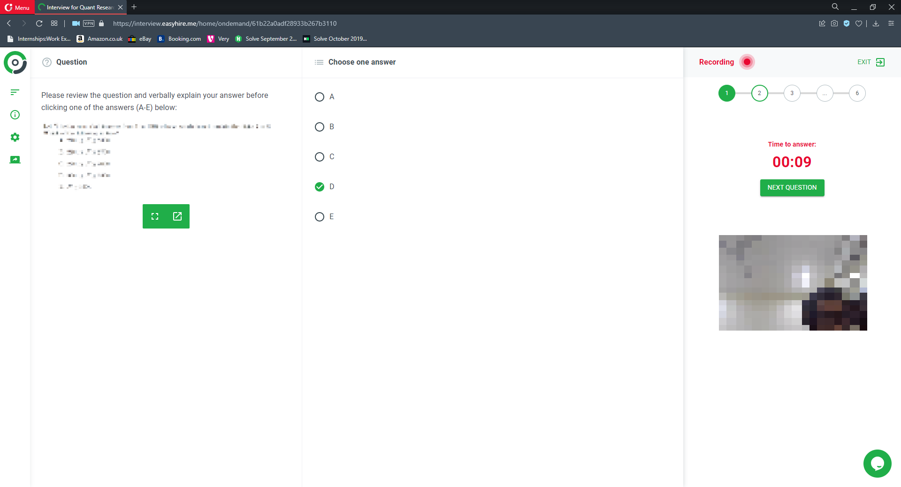

## Junior Quantitative Researcher

### Parameters

* Role: Junior Quantitative Researcher
* Location: Remote (Europe)
* Applied: December 6, 2021
* Notification of failure: February 1, 2022

### HackerRank entrance exam

This stage consisted of three LeetCode mediums (one simulation-based greedy, one standard greedy, one simple memoisation/pre-computation), to be done in either C++ or Python. Interestingly, 

* they said to pick any two to do; if the third is done, it would be considered as bonus
* they explicitly told me to focus on code cleanliness and readability, which is quite rare to see. 

I did the test in C++, getting all 3. My focus was naturally on correctness, though I did pay more attention to cleanliness and readability, and spent some time on that. For some reason, I was running into a weird problem with Q1 - one or two test case would randomly fail which strangely wasn't always reproducible (that is, half the time it would report that I got 100%, and ~90% in the other half). I couldn't fully track down the reason for the issue, but suspect it may be some kind of subtle memory leak. Either way, I had more than satisfied the requirements.

### Mathematical video interview/exam

After that, I had to complete a one-way "video" interview. This was odd, because normally a video interview would be non-technical, but this wasn't that. 

It was five mathematics questions, ranging from tricky probability questions (for instance, asking me to work with moments) to checking for diverging integrals. For me, it went **horrendous**, and I think I actually got only one right (given that I resolved the questions after the interview). You were given five minutes to think _and_ answer the question, and I struggled a lot with that, especially given that I was not permitted to, for instance, refresh my memory of what a moment was. I also had to give the final answer!

I finished this stage thinking that I would get thrown out right after. To my surprise, I somehow did _not_ fail; really not sure how.

### Technical interview

> I was told not to share the questions by the company, and have to respect that. 

I was then asked to schedule a video interview with a member of the quant team. I was given a tricky probability problem involving expectations. And ... I flunked it. I found it hard trying to understand what the interviewer was hinting at, and kept on applying conditioning for some reason. I knew I was getting somewhere, but I have to admit that I did not manage to solve the problem.

I was also asked questions on my CV and project. For some reason, even though I was told that I would be asked coding questions (and the interview was conducted via HackerRank's CodePair platform), I wasn't given any. Maybe because I did so poorly on the probability problem. 

### Notification of failure

Was by email, generic. A request for feedback returned only this:

<blockquote>

Hi Leader,

Thank you for your note. In terms of feedback from our Quant team, we decided to proceed with candidates who demonstrated even stronger proficiency in probability and statistics, as well as strong coding skills.

We wish you the best!

Akuna Capital Recruitment

</blockquote>

I know, tell me something that isn't obvious... Also, I find the mention of coding skills odd given that I did OK in the coding exam and that coding wasn't tested in the technical interview. 

### Takeaway

This failure (and writing this up) made me ashamed at myself for being utterly incompetent.