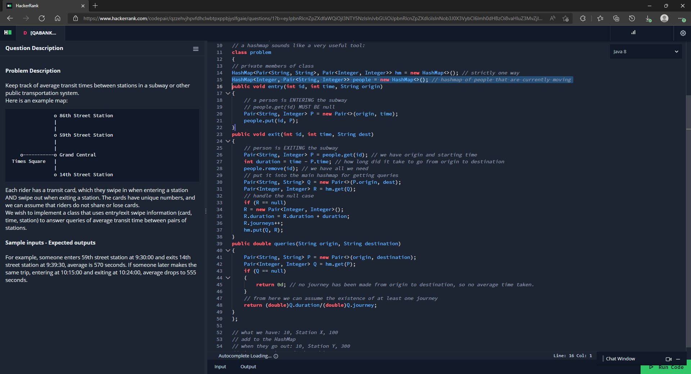
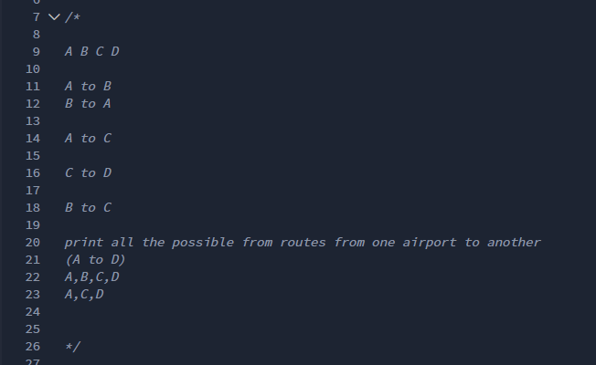
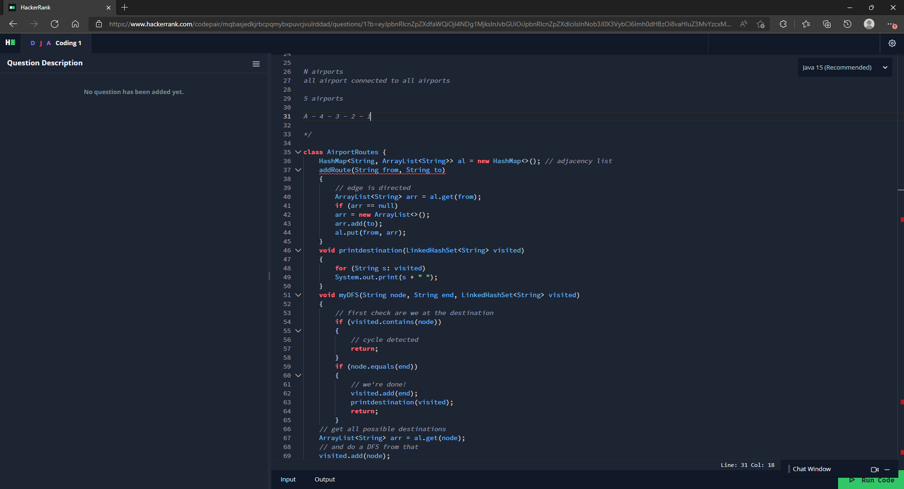
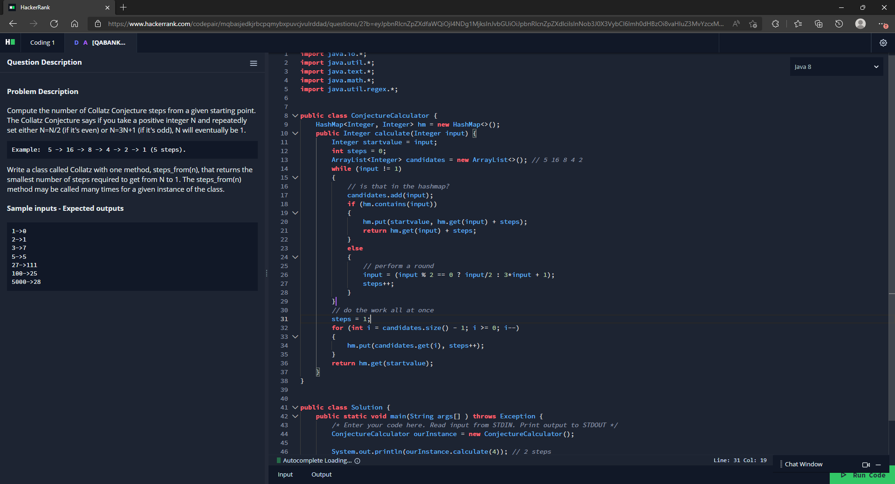

## 2022 Software Engineer
### Parameters

* Role: 2022 Software Engineer
* Date of application: February 1, 2022
* Round 1 interview: March 29, 2022
* Round 2 Part 1 interview: April 12, 2022
* Notification of failure: April 13, 2022
* Feedback call: April 28, 2022
* Location: London, United Kingdom

### Prelude

I've found Bloomberg's initial process weird. For some reason (at least for the UK), they didn't list the application on their public recruitment platform, which made me confused and I wasn't sure whether they simply weren't hiring for new grad at all (as Morgan Stanley did for the 2020-21 recruitment season). In reality, some of my peers were contacted by a recruiter (via LinkedIn) and invited to apply though a private link. I was sent a screenshot from someone who got such an invitation, and it was mentioned that a specific referral source should be specified. Of course, I was _not_ invited (and by extension, not eligible to apply then). 

Now, I was told a few months later that they indeed put up a [public job posting](https://careers.bloomberg.com/job/detail/93145), and that's when I applied. 

### First round interview

A few days after applying, I was invited to set up first-round interviews, and was asked to set up times for it. I wasn't even sure if they had slots (given how late it was). I looked at the form after a week, but then all the slots were gone, and was given new ones. I eventually chose to have it on March 29 (there were earlier slots, but I was having finals around that time). 

Now, for the interview itself (over the phone with HackerRank CodePair, no video). It was with (interviewer), and I was first served stock questions (why Bloomberg, describe a project, tell me about yourself) - preparing for them helped. Then I was given [this LeetCode problem](https://leetcode.com/problems/design-underground-system), which according to [this page](https://github.com/krishnadey30/LeetCode-Questions-CompanyWise/blob/master/bloomberg_6months.csv) was the most popular Bloomberg problem in the last 6 months.

I knew how to do this one (did not realise it was that popular, otherwise would have told), and was naturally asked to describe my approach and then code it. Remembering from my [Facebook failure](../Facebook/Software%20Engineer,%20University%20Grad.md), I did ask the interviewer on the code quality, to which I was told that it didn't matter. I did note that the interviewer asked about whether there was a way to avoid having to use a pair (I suspect he was hinting to string concatenation though I didn't realise that during the interview). Then I was asked to write it using a class (as shown in my answer above) and was asked to describe the time and space complexities, which was straightforward for me. There were also some followups (for instance, the original form of the problem assumed that users cannot lose cards, and I was asked what would happen if that was possible - and I gave the idea of performing a form of garbage collection to ensure that the hashmap size does not simply grow). At the end, I was given the chance to ask question, which I did, and that was the end, in about 53 minutes.

I thought I did OK overall, but was surprised and a bit concerned that I was asked only one question (given that some on the internet reported getting two). Turns out I did _not_ fail this round.

### Getting to the onsite

The recruiter told me to give at least three time/date combinations to set up the 90 minute onsite, which as it would turn out to be, was only one of the three stages (the other two would be system design and the HR part), and would happen separately (which confused me, since it _felt_ as if these two rounds would be part of the same day, when it wasn't). I did that, and then was scheduled for 11:30 am on April 12. 

Just before the interview, I was waiting for a phone call, but there wasn't any incoming. I was confused on whether I made a mistake and checked the email, only to realise that it was actually a _video_ interview (fortunately, I had that ready in equipment and was able to quickly join). 

### The onsite: Part 1

There were three people in the call, one of which was just "shadowing" and hence not really "interviewing". 

As with the first round, I was served some stock questions (why Bloomberg, describe a project), but also a "cheeky" question (as defined by the interviwer) that asked me about resolving conflicts in a team project (but then I've never had such a case, as I had to, in a somewhat confused form, explain). 

Now about the questions. The first question was a variation of [this LeetCode Medium](https://leetcode.com/problems/all-paths-from-source-to-target/), with the main difference being that the end node was given, and crucially, it could not be assumed that the graph was acyclic (what was _not_ possible were multigraphs):

I started off by giving a classic DFS approach (as shown above) - it wasn't particularly efficient mainly because I hadn't yet implemented backtracking (that is, I was at that point depending on the ``LinkedHashSet`` being passed by value as otherwise different recursion states will have the same set of visited notes, which will mess things up). Though I knew that, and was asked on how this issue could be fixed, which I correctly told them was to backtrack by inserting a line to delete the node that was added after completing each recursion. 

Then I was asked to describe the time complexity, and that's where I unexpectedly messed up. Now, what would be the worst-case scenario for this problem? When the graph is complete (Kn). But then what's the time complexity of this scenario? Unfortunately, I mixed up paths with edges and incorrectly said that it was O(n2) (as the number of edges in a complete graph is (n2 - n)/2). The problem is that we're actually performing depth-first search across the **paths**, and the interviewer had to correct me and actually guide me towards showing that it was actually O(n!), which was quite embarrassing. The space complexity part was OK. 

    
Poking deeper

The problem I ran into was finding the number of paths in a complete graph. The interviewer used this approach in guiding me:

Start from the first node. How many ways are there to go from one node to another? _n_ - 1 (because we can go to any node other than the node we started). From that node, how many ways can we go? _n_ - 2. Considering that we multiply the number of ways at each stage, the result is (_n_ - 1)(_n_ - 2) .. 1, which is (_n_ - 1)!, though I recall saying _n_! instead. 

When I first researched this on [Stackoverflow](https://math.stackexchange.com/a/2406930), I thought that was also wrong, but when writing this up, I realised the confusion (the Stackoverflow answer was additionally referring the length of the edge), and the above answer is indeed right. 

Regardless, this should have **never** happened. 

Now, for the second question. It was the [Collatz conjecture problem](https://leetcode.com/discuss/interview-experience/1504782/bloomberg-phone-interview-1042021-collatz-conjecture-rejection), and I was told that it should be considered from a production point of view. 

I was asked

* what the time complexity was. I assumed it was to the naive version of the problem, and said that it isn't possible to derive a time complexity bound, which is actually [correct](https://cs.stackexchange.com/a/54268) given that it's a conjecture.
* to explain what issues the naive version could have in production, to which I said that overflow (as 3*n* + 1 need not remain in the integer space if _n_ is an integer) and time can be issues, and when told that they weren't issues, pointed out that the recursion stack space can be exhausted. 
* as a result to the above, I was asked how the performance can be optimised in an amortised manner, to which I righly said that the problem can be simplified through memoisation. My first answer to this didn't actually work for the stated example (it wasn't wrong, just not applicable) and I had to rewrite my solution as a result, roughly resembling in the solution above. I also made some minor errors along the way, which was pointed out (and fixed). 
* to explain how the code could be cleaned up. I did make some suggestions, but doubt the interviewers were convinced. I should note that unlike the phone interview, they did seem to care about code quality even for the first question, which I tried, but again doubtful on how well I did there.

And after that, just like the phone interview, I was given the chance to ask questions, and that was the end, in about 63 minutes. 

### Notification of failure

When researching about Bloomberg, I found out that supposedly a failure is notified much faster than a non-failure. And in my case, that was true, because the next evening, I got the failure email:

<blockquote>

From:	Human Resources HRes (BLOOMBERG/ 731 LEX) <hrblpnyk@bloomberg.net>  
Sent:	13 April 2022 18:27  
To:	Leaderboard  
Subject:	Bloomberg Follow-up

Hi Leader

Thank you once again for your application to 2022 Software Engineer position and your interest in
Bloomberg.

Unfortunately, we have decided not to proceed with your application at this time. We really appreciate
the time and effort you dedicated to the application process with us here at Bloomberg. We know there
are a lot of companies out there and we hope you know how happy we are that you chose us. The
decision to pass on your candidacy was not an easy one and we encourage you to keep current on our
careers site for future opportunities.

We would be happy to offer you feedback on your interviews with us. Please send an email to
engrecruit3@bloomberg.net if you would like to arrange a call. Unfortunately we are not able to provide
written feedback.

We wish you all the best for your future endeavours.

Kind regards,
Engineering Recruitment Team
Bloomberg LP

NOTE: , email entrylvl_eng@bloomberg.net with any questions

Stay connected with us on social media!  
Follow us on Twitter (@BloombergCareer) and at facebook.com/BloombergCareers Please note that this
mailbox is unmonitored and replies will not reach the Bloomberg Human Resources Department. Please
do not reply.
</blockquote>

What's interesting is that they explicitly offered to share feedback. Why they can't do it via email but can by phone (given that the phone method is more involved for both parties) isn't something that I know, but I was still pleasantly surprised given that it's very rare for a company to do that. I immediately emailed back confirming my interest in the feedback call.

### The feedback call

Was via Zoom. Annoyingly, the first two times no one showed up and I was simply left idling. The third time, the recruiter came 15 minutes late, which made me ask her on why it wasn't possible to simply send the notes via email. Her answer was unconvincing - said that it's "policy" and that other companies do not give feedback at all (which may be true, but doesn't answer my question). Regardless, here's a paraphrased version of the notes I took in the call:

<blockquote>

**Bloomberg failure**

_First phone round_

Subway transit time. Good communication, motivation etc. For technical part, could do well with almost no help. Could answer questions about time and space complexity with no issues. Discussed follow-up properly, provided verbal solution and the engineer thought that was no need to code it up. Good answers to stock questions such as "Why Bloomberg" (mentioned combining tech and finance). No issues overall. 

_Second technical round_

asked Airport routes. Solved both quickly, code could be a bit cleaner. Weak communication skills. Less introduction (i.e, weak performance) in CV round. Reasonable technical skills/communication, could not take hint on feedback (tried to give feedback to answers/hints, felt like I was trying to lead my own way and was unable to take the feedback from the interviewers). Communication was the weak part (which eventually caused my failure).

Did not seem to be as interested on why Bloomberg - the interviewer thought that more research was needed. Engineers thought the interview did not go as well as the phone interview, could not gain as much information from the candidate. Recommended more practice.
</blockquote>

This is interesting. Notice that I referenced above that I made an error in my time complexity; this was not referenced in the feedback (which said that my technical skills were reasonable). The issues pointed out were

* at my communication skills - unfortunately, mirrors my [Facebook failure](../Facebook/Software%20Engineer,%20University%20Grad.md). 
* at my weak answers to questions such as "Why Bloomberg". This was a bit more surprising, and I should note in particular the rather bipolar feedback on this in the phone and technical interview. The recruiter suggested that it may have been because the questions were repetitive, but noted that they are still important.

A TLDR; of this would be to note that despite the interview being technical, they care about the non-technical aspects, and from the feedback that I got, was what let me down at that interview, and that I somehow did OK in that in the phone interview. 

P.S: I was told at the call that the cool-down period is 6 months (not a year as some other companies do). I was also sent a follow-up email, which included the below links:

<blockquote>

As mentioned, please also find some useful resources below. This should help with tips on how to prepare for an interview with us in the future.

[How to Write a Technical Resume](https://youtu.be/KhbaY2UUtWU)  
[How to Prepare for a Technical Interview](https://youtu.be/x7BtTnZwkgE)  
[Mock Technical Interview Workshop](https://www.youtube.com/watch?v=lhKwiMnkFNI)

Tell me more about Bloomberg...

* [We are Bloomberg](https://www.bloomberg.com/company/we-are-bloomberg/)
* [Engineering at Bloomberg](https://www.bloomberg.com/careers/technology/engineering/)
* [Tips for a successful interview with us](https://www.bloomberg.com/careers/technology/engineering/software-engineering-student-recent-graduate/)
* [What we do for the world around us](https://www.youtube.com/watch?v=bVcdS808p80)
* [See what our Engineering teams are up to](https://github.com/bloomberg)

</blockquote>

Overall: despite the annoyance of having to get this via a phone call (and having to reschedule the call twice due to no one showing up the first two times), the feedback was very useful and I do appreciate Bloomberg for providing them (without having to take the GDPR route as with some other companies).

### Takeaway

* Even though my failure ultimately was not related to raw technical skills, I am still embarrassed over messing up the time complexity. Wonder whether that played a part? 
* Also: they care about the stock questions, and somehow I managed to perform quite differently to the same question in the two rounds.
* I also wonder whether this could be a case of "the nerves getting the better of me", given that it was my first time at an on-site at Bloomberg.