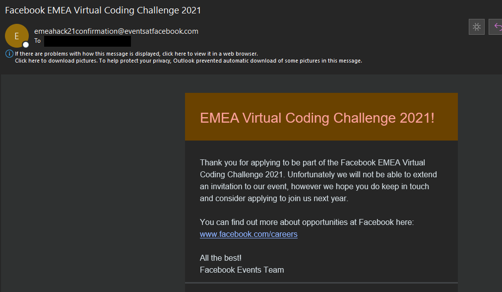
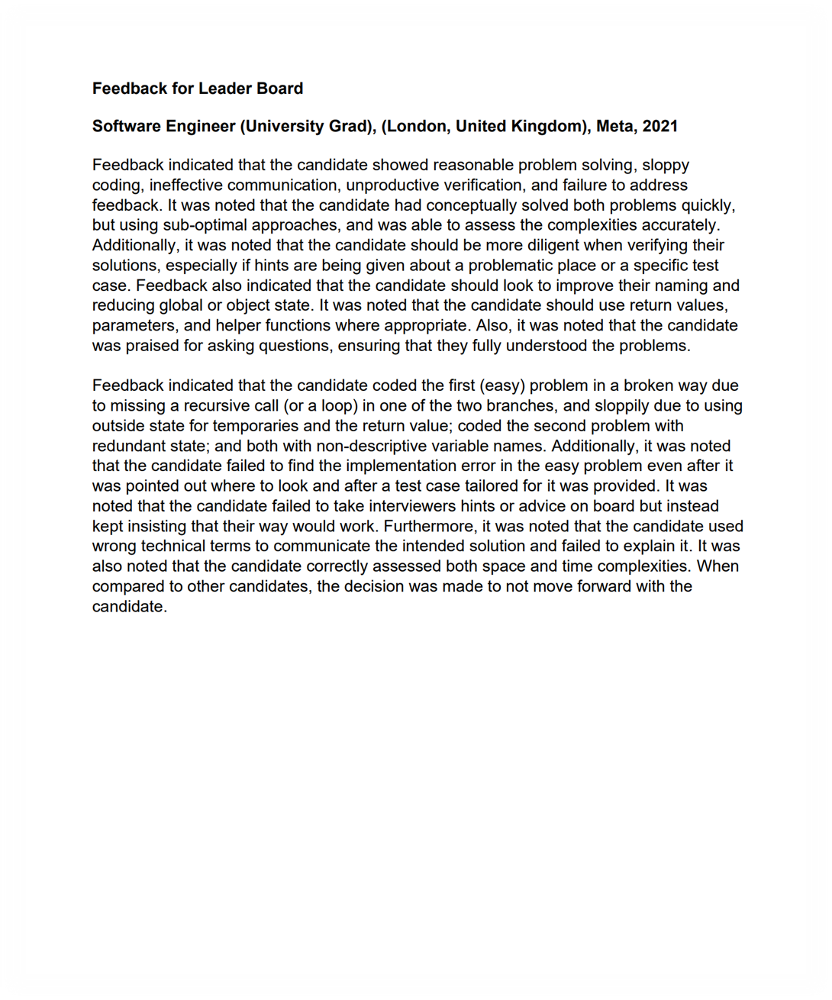

## Software Engineer, University Grad

### Parameters

* Role: Software Engineer, University Grad
* Location: London, United Kingdom
* Applied: August 17, 2021
* Notified to Round 1 interview: September 29, 2021
* Round 1 interview: October 11, 2021
* Notification of failure: October 12, 2021

### Prelude

Historically, I've never been able to get a reply from Facebook despite this being my fourth successive year of attempts. The route though which I managed to get the attention was non-standard.

I did the HackerRank entrance examination for the “Facebook EMEA Virtual Coding Challenge 2021” event, butchering that LeetCode medium (technically 2-D DP, though there was a O(1) loophole) in about 12 minutes (so about a quarter of the allocated 50 minutes). Hence I was confused when I ended up being rejected from the event (because if not HackerRank, what else?). Some time later, (recruiter) (a recruiter at Facebook) sent this email:

<blockquote>
From: (recruiter)  
Sent: 22 September 2021 18:19  
Cc: (recruiter)  
Subject: Facebook - Thank you!

Hi there!

Thanks so much for signing up to our Crush Your Coding Interview Workshop. We really hope you found it useful and engaging.

I am very sorry for the issues with the sign-up link, if you weren’t able to attend we do have two other crush your coding interview workshops available for you to attend:  
•	12th October https://crushyourcodinginterviewworkshop12oct.splashthat.com/  
•	28th of October https://crushyourcodinginterviewemea-oct28th2021.splashthat.com/

If you did manage to attend, at Facebook we are constantly looking to improve, so we would really appreciate your feedback on the event - feedback is a gift! With this in mind, please could you take 2 minutes to fill out this survey:
https://forms.gle/HodfgCsGfbdBnt4U7

We also have opened up our Software Engineering Intern & Graduate opportunities. If you would like to find out more about the roles we have available at the moment please go to facebook.com/careers.

Much appreciated,

(recruiter)
</blockquote>

So I sent this, partially out of confusion:

<blockquote>
Dear (recruiter),

I don’t recall signing up for this particular one (though I might have forgotten); rather I applied for the “Facebook EMEA Virtual Coding Challenge 2021” event, but failed despite getting a full mark in the HackerRank exam in about 10 minutes:

Is this connected with the issue you mention in any way? I ask because I found the rejection puzzling given that the criteria mentioned was only the HackerRank score, which I believe I did reasonably well in by completing in approximately 22% of the time limit. Thanks in advance.

Regards,  
Leader
</blockquote>

She came back:

<blockquote>
From: (recruiter)  
Sent: 23 September 2021 10:50  
To: Leader Board  
Subject: Re: Facebook - Thank you!

Thank you Leader and apologies for the confusion, you have not been taken forward for the coding challenge but you are welcome to sign-up for these events.

Kind regards,

(recruiter)
</blockquote>

That didn't answer my question. So I resent my question:

<blockquote>
From: Leader Board  
Date: Thursday, 23 September 2021 at 08:52  
To: (recruiter)  
Subject: RE: Facebook - Thank you!

Dear (recruiter),

Is there a reason why I’ve not been selected <i>despite</i> completing the coding challenge, with a full score, in 22% of the time? Thanks in advance.

Regards,  
Leader
</blockquote>

She replied:

<blockquote>
Hi Leader,

Thank you for your email.

I am afraid we do not give feedback on at this stage; we received a very high volume of applicants for a limited number of places for our event, and therefore we do have to take some tough decisions in our process. However, this does not affect your chances at interviews for a position here at facebook and we would very much encourage you to apply.

Kind regards,

Regards,  
(recruiter)
</blockquote>

So she didn't want to answer the question - this is a major source of frustration I have with companies not willing to even tell me why I've failed from something. At least she invited me to apply to Facebook - which I already did more than a month back...

But then she came back again a day later and formally started the process, asking me to answer questions such as my expected month and year of graduation and similar. I've never gotten this far before! After that, I was invited for Round 1 interview - this would end up being my first ever interview of this nature. 

Note: I didn't get an automated confirmation email after applying, noting since I've seen queries about it.

### Round 1 interview

This was with (interviewer) and on a Zoom-based platform, using a Coderpad link which didn't allow for any form of compilation. Unfortunately, I did sign a NDA and hence full description of the questions cannot be provided. 

* The first question was a LeetCode Medium that was an array-based DFS problem. I got this one fully.
* The second question was linked to (but not exactly) LRU Cache - I solved this one by chaining hashmaps and treemaps.

I did find the questions hard to understand though. For instance, the first question was framed in a way that made it hard for me to understand what you wanted _me_ to do - the input/output was undefined for me for instance which made it weird personally. Is this something that Facebook expects? I don't know. Plus, I felt that she was struggling to understand my approach for Q2 - I was trying to explain it to her but she seemed fixated on something else. In the end, she just asked me to code it...

### Notification of failure

Was by email a day later, explicitly mentioned that feedback cannot be provided. For those interested, here is the failure email:

<blockquote>
Hi Leader,

Thank you for taking the time to interview for the Software Engineering position. After careful consideration, we have decided to not move forward with your candidacy at this time.

We value the time you have taken to find out more about careers within Facebook. You will be contacted if we find that your qualifications match any additional roles that you've applied to. Until then, we’d encourage you to continue checking back on our careers page for future opportunities. I am afraid we are unable to give any further feedback.

All the best,  
(recruiter)  
Facebook Recruiting Team
</blockquote>

What a joke. Messages like these do not help me at all. Yet you ask me to provide feedback...

### Getting the feedback: GDPR

_Written on January 28th, 2022_

Thanks to a [couple of posts](https://www.reddit.com/r/cscareerquestionsEU/comments/s4gbgk/use_gdpr_to_read_my_scorecards/) on Reddit, I realised that I could potentially circumvent their "policy" of not giving feedback on failures and invoke the GDPR to get my feedback. So I did that (to mydataprivacyrights@fb.com), utilising the template provided in the linked Reddit post to Facebook:

<blockquote>

Hi,

I would like access to all of my interview feedback data for the SWE New Grad phone interview for London, UK. I interviewed on October 11, 2021.

This is a formal GDPR request to access this data.

Regards,  
Leader Board
</blockquote>

And they came back to me:

<blockquote>

Hi Leader,

Thanks for contacting us.

Based on the information you provided, it looks like you're trying to exercise your rights under the EU's General Data Protection Regulation (GDPR), with regard to recruiting and HR related information.

We're looking into your request and will respond shortly.

Thanks,

People Data Privacy Team

</blockquote>

Their definition of "will respond shortly" is about two weeks - but this is what I received 13 days later:

<blockquote>

Hi Leader

We refer to your personal data access request from 15 January, 2022 for personal data access for interview feedback. We have attached our response.

Please note that for security reasons, the attached document is password protected. We suggest that in order to ensure secure transmission, we will provide the password to you separately. Please respond indicating a different email address or physical address for this purpose. However, if this poses an issue for you, please confirm that you are comfortable receiving this password at the same email address.

Thank you,  
People Data Privacy Team
</blockquote>

Attached was a PDF that required a password (and supposedly encrypted and hence not crackable by online PDF password cracker tools), and I had to either give them another email/location for that or confirm that it was fine to send the password to the same email! That's odd to me. But then I did that, and the same day got the "decryption key". 

The PDF itself consisted of five pages. Four of them are legalese about Facebook and the GDPR - the feedback itself is in the last page:

<blockquote>

**Feedback for Leader Board** 

**Software Engineer (University Grad), (London, United Kingdom), Meta, 2021**

Feedback indicated that the candidate showed reasonable problem solving, sloppy
coding, ineffective communication, unproductive verification, and failure to address
feedback. It was noted that the candidate had conceptually solved both problems quickly,
but using sub-optimal approaches, and was able to assess the complexities accurately.
Additionally, it was noted that the candidate should be more diligent when verifying their
solutions, especially if hints are being given about a problematic place or a specific test
case. Feedback also indicated that the candidate should look to improve their naming and
reducing global or object state. It was noted that the candidate should use return values,
parameters, and helper functions where appropriate. Also, it was noted that the candidate
was praised for asking questions, ensuring that they fully understood the problems.

Feedback indicated that the candidate coded the first (easy) problem in a broken way due
to missing a recursive call (or a loop) in one of the two branches, and sloppily due to using
outside state for temporaries and the return value; coded the second problem with
redundant state; and both with non-descriptive variable names. Additionally, it was noted
that the candidate failed to find the implementation error in the easy problem even after it
was pointed out where to look and after a test case tailored for it was provided. It was
noted that the candidate failed to take interviewers hints or advice on board but instead
kept insisting that their way would work. Furthermore, it was noted that the candidate used
wrong technical terms to communicate the intended solution and failed to explain it. It was
also noted that the candidate correctly assessed both space and time complexities. When
compared to other candidates, the decision was made to not move forward with the
candidate.

</blockquote>

So, this is interesting. Marking the rejection feedback itself, it's a good piece of feedback in general (one of the _best_ I've gotten this year) - clearly gives an indication of (what they thought of was) my weaknesses and how I performed in the two questions, albeit briefly. Weaknesses included no statistical data, no explanation on what in particular caused me to fail overall (you give a bunch of faults, but no clarity of which, if any, sealed my fate), and could be more in-depth by question (see my reflection on the feedback). Note that I'm not commenting on the correctness of their feedback at this stage. This should be provided by default to every candidate - it really can't be that hard, can it? I really shouldn't have to take the GDPR route to get this - kind of shameful from Facebook.   

Now, reflecting on the feedback they provided and comparing to what I _thought_ was my performance on the interview:

* I didn't know that they cared on cleanliness ("sloppy coding"); don't think I particularly focused on that during the interview.  I was not as surprised on the communication aspect given my earlier thoughts in this write-up. 
* "candidate had conceptually solved both problems quickly, but using sub-optimal approaches" - eh? I can understand why Q2 may be thought of as sub-optimal (see the _Takeaway_ section), but my answer for Q1 was optimal to the best of my knowledge (O(_n_) time) - if not, that's a serious and uncaught bug that I need to fix! 
* "it was noted that the candidate should be more diligent when verifying their solutions, especially if hints are being given about a problematic place or a specific test case" - a reason why you should have given this earlier. I _think_ it's for Q2, but I can't recall the exact instance which may have caused this feedback, and am not completely sure on what this means either.
* "Feedback also indicated that the candidate should look to improve their naming and reducing global or object state" - looks like from the cleanliness section. This is useful feedback. Same for the ones in the second paragraph that deal with this section.
* "Additionally, it was noted that the candidate failed to find the implementation error in the easy problem" - I just can't recall where that could have happened (note that isn't a statement of denial).
* "It was noted that the candidate failed to take interviewers hints or advice on board but instead kept insisting that their way would work." - that happened in Q2. I found it hard to communicate with this aspect on the interviewer. My intention was not to insist on a particular approach, but I was not getting what the interviewer was hinting at unfortunately.
* "the candidate used wrong technical terms to communicate the intended solution and failed to explain it." - what? I don't recall this happening anywhere - again if true, I need to fix that urgently since it's a serious problem. I think it would help if they gave the exact location where that happened. 

But overall, it's nice that I got this - helps me in understanding _some_ of my mistakes in the interview and I hope this helps others as well.

### Takeaway

* The non-standard way I managed to not get ghosted in my fourth attempt should be noted.
* With a failure that didn't tell me why I failed (update: see the GDPR section; no longer true), I had no idea on what I missed. I looked at other users' interviewing experiences and some did say that they got through with only solving one question out of two. That made me wonder - what did I miss? Communication challenges could be a part, but I started digging into that second question later and realised I may not have given a perfectly optimal solution. My solution was O(log _n_) time and O(_n_) space - however I think there was a O(1) time option available.
* The bug stems from a conceptional blunder on linked lists. I thought that accessing a specific element in a linked list is O(_n_). This is correct indeed - but what I missed is that given a hashmap, you _can_ access a specific element in constant-time (which was a solution in the original LRU Cache problem)! The root cause of my error was my forgetting that I could have used linked lists from first principles instead of relying on Java's linked list library. 
* GDPR is a good thing - and Facebook _can_ provide (useful) feedback!