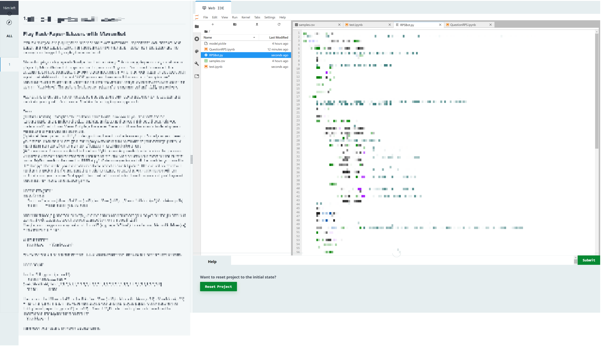

## Quant Researcher

### Parameters

* Role: Quant Researcher
* Location: London, United Kingdom
* Date of application: January 10, 2022
* Notification of failure: February 15, 2022

### Prelude

For the 2020-21 season, I applied to Maven for a graduate SWE role, failing at a standard stage - the one-way video interview part (after passing the Codility entrance exam, which was a LeetCode Medium on floodfill to be done in 150 minutes). I was about to try again (for a different graduate role) next year and sent them a standard question regarding that graduate role. The response was that I cannot apply for that role since I've been permanently banned from applying for graduate roles. This surprised me, and I asked them to show evidence of this, to which they pointed me to the [FAQ](https://www.mavensecurities.com/faqs/can-i-reapply-if-i-have-previously-been-unsuccessful/), and indeed:

<blockquote>

**Can I reapply if I have previously been unsuccessful?**

Unfortunately, if you have previously applied to our graduate programmes unsuccessfully, your application will not be considered.

</blockquote>

This was a rude surprise. I'm aware that after a failure, there is usually a standard _cool-down_ period (usually up to a year), but never before have I come across a company that would give you a permanent ban (for graduate roles). Again, they _did_ disclose this, but I must have glossed over the first time because I didn't know about the ban without sending that email.

Now, a few months later, I got a standard careers email at my university for the quant researcher role. Per standard practice, I looked at the description, and it indeed did interest me. But then since I was under a permanent application ban (though for graduate roles), did this mean that I was banned from applying for the quant researcher role? Perhaps surprisingly, the answer was a no.

### HackerRank entrance exam (Stage 1)

After applying, I was told to sit the first HackerRank entrance exam. The test had two sections:

* Mathematics and ML MCQ (7 questions, 20 minutes in total): focusing on probability, statistics and some basic ML. Wasn't bad, though the options were tricky and had good red herrings.
* Coding (20 minutes + 20 minutes + 35 minutes): one LeetCode easy and two LeetCode mediums; the first one was greedy, the second one was a stack problem, and the third one was a tricky 2D DP. I got the first two fully; gave a non-answer for the third one as I ran out of time fixing the bug in the 2D memoisation table (figured out a few minutes after the test ended). 

It should be noted that unlike nearly every other test I've done, the time limits were _sectional_. This meant that going back and forth between the four sections (the three coding problems + the mathematics MCQ) was not possible, and once a section was exited, it was not possible to go back for any reason. This made the test somewhat more time-pressured for me; I was unable to "bank" time from the MCQ and the non-DP coding problems to use in solving the DP problem - had that been possible, it's likely I would have gotten the DP problem as well. 

### HackerRank entrance exam (Stage 2)

After this, I was asked to complete another HackerRank exam, this time a data science/ML problem for 4 hours (which I've never done before). A screenshot of the HackerRank interface is shown below, with the question and code pixelated per repository policies:

I didn't really know how to do these kinds of problems, but given the time limit, I decided to give it a try. In the end, I decided to use a Bayesian inference approach, basically using the available prior to deduce the best posterior (i.e, that would best solve the maximisation problem). Given that the question references using a _pickle_ (which mine didn't), I suspect that was not the right way to do it. 

### Notification of failure

Was by email (with a title "- Sorry, it's not quite a match."), and precluded getting feedback:

<blockquote>
<small>
Hi Leader, 

Thanks for applying to Maven.

We've looked through your application, and unfortunately, we've decided not to progress. We're unable to give further feedback at this stage.
</small>

Thanks for the time you have dedicated so far and best of luck for the future.

<small>
Best wishes,  
_The recruitment team_
</small>
</blockquote>

### The GDPR attempt

I sent a standard GDPR request to [dataprivacy@mavensecurities.com](mailto:dataprivacy@mavensecurities.com):

<blockquote>

Hello,

I would like access to all of the recruitment data you have (specifically the ones used to make a decision on my application) with me with respect to the Quant Researcher role. This includes the scores I got on the two HackerRank exams, and any feedback you have as a result.

This is a formal GDPR request to access this data.

Regards,  
Leader Board
</blockquote>

I got this a couple of days from [legal counsel]:

<blockquote>

Dear Leader,

I hope you are well.

Thank you for your email of 15 February 2022.

By way of introduction, I work in Maven's legal team.

I am reaching out to confirm receipt of your Data Subject Access Request ('DSAR') under Article 15 of the General Data Protection Regulation ('GDPR').

We will respond to your request as soon as possible and, in any case, within one month of receiving your request.

In limited circumstances (for example, if your request is very complex), we may take up to three months to respond. If that's the case, we will let you know shortly.

Kind Regards  
[legal counsel]
</blockquote>

About a month later, I got the response:

<blockquote>

Dear Leader,

I hope you are well.

I am writing in response to your data subject access request dated 15 February 2022.

I am pleased to inform you that this request is now complete.

Please see attached a PDF containing your personal data as requested.

I have also attached a letter detailing the searches undertaken by Maven and a copy of Maven's Recruitment Privacy Notice.

Kind Regards,  
[legal counsel]

</blockquote>

So what's in that email? Two PDFs:

* The first one was just legalese about the privacy policy, what information they held, and what they redacted themselves (mainly the ones that weren't my personal data).
* The second one contained the data. Most of them was useless from my perspective (like my CV, and email exchanges). The only useful bits were these:

<blockquote>

[redacted], 

Leader Board submitted a take home test for Quant Researcher (SA10) on Tue Jan 18, 6:07pm GMT. You've been asked to grade this test.

Click here to view the submitted test and fill out your scorecard. 

**Score** 20.0

</blockquote>

<blockquote>

[redacted],

Leader Board submitted a take home test for Quant Researcher (SA10) on Tue Jan 11, 7:31pm GMT.

**Score** 127.0

</blockquote>

Naturally, I found this quite underwhelming, especially compared to some others I've received. The only thing I could infer was a confirmation that I failed the ML take-home exam. I don't even know what percentage I got in either section (because the maximum mark was not mentioned anywhere)! BTW: the take-home test was _not_ automatically scored (as there weren't any test cases nor was I given any indication of a score), and I am not sure where they got the 20 from. 

### Takeaway

* Unfortunately, this is another case where I failed a coding examination, which is not normal; this happened because I was not familiar with ML-style HackerRank exams (the practice test simply gave a feel into the interface itself).
* I don't get the purpose of giving permanent bans for _any_ role - I've seen cases of people failing one year but passing the next. That raises the question: did I earn a permanent ban from applying from this (the quant researcher) role as well? Didn't ask them. 
* In my GDPR response, they also included communication on the 2020-21 graduate role I failed. Again, there was too little information to make use of (didn't even provide the entrance exam mark I got in Codility). The reason for why I failed? "Reason: Preferred another candidate". I don't quite think that was the _true_ reason. 
* The prospect of being hit with a permanent ban for a role has made me scared, since I would not know if I missed some "fine print" - and even if I didn't, I would have to watch out for unwritten rules (which affected IMC in that I was given an extended 17-month ban which was not mentioned anywhere on their website). 