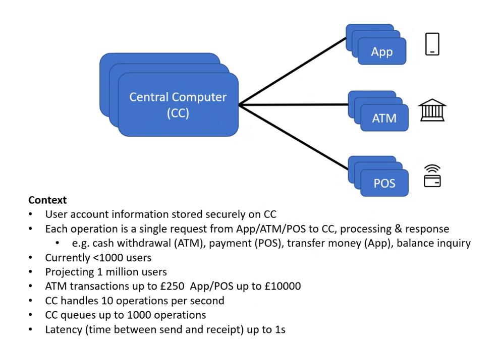

## UK New Grad

### Parameters
* Role: Software Engineer (SWE)
* Date of application: October 2, 2021
* Notification of qualification to Round 1 interview and Codility examination: October 4, 2021
* Round 1 interview: October 25, 2021
* Notification of qualification to Round 2 final set of interviews: November 1, 2021
* Round 2 set of interviews: November 16, 2021
* Notification of failure: November 24, 2021
* Location: United Kingdom

### Codility examination

Note that you only get it if you get to the first-round interview - so this isn't something that everyone gets.

This was a standard Codility examination - 3 questions, 80 minutes. Two of them were LeetCode easies and one was a LeetCode Medium (greedy). Finished in about half time. 

### Round 1 interview

This was held by (interviewer) from Korn Ferry International - note in particular that this isn't Microsoft itself, rather Korn Ferry International interviewing on behalf on Microsoft! This is important as can be seen below.

For some reason, the interviewer kept their video off citing an issue (mine was off as well). The interview was mainly stock with a somewhat technical nature. For instance, some questions they asked were:

* (classic) Why Microsoft?
* What teams would you be interested at Microsoft?
* What is your favourite Microsoft product?
* (as a follow-up) How would you explain multithreading to someone that isn't technically inclined? 
* They also asked me to explain a project that I did.

At the end, they gave me a brainteaser. This one to be exact:

... which I was a bit surprised since I thought Microsoft doesn't ask them anymore. Fortunately, I managed to get the answer right (which is yes: 40 = 30 + 31 + 32 + 33 and brute-force) and the interviewer confirmed as such. The interview ended up taking about 30 minutes.
### From Round 1 to Round 2

After that, my recruiter (which was actually from Microsoft) let me know that I got into the final set of virtual interviews, which would be 4x45 minutes and end up taking about 4 hours of my time. I was asked to fill up a "form" with questions asking on my preferred location (London Enfield, "Midlands" which I took to be Reading, Edinburgh and Cambridge) and what factors would be most important in a job for me. Keep in mind the latter. 
### Round 2 interview

I interviewed for Azure for Operators (this is important because to me, that appeared to influence the questions I got).

* Round 1 was a OOP-based design question. I think I did very poorly in this one - OOP isn't something I work with regularly and I had no idea Microsoft asked such questions. The OOP question was about designing a calendar. Focused a lot on OOP principles and the skeleton rather than the algorithmic structure - I wasn't even sure what was expected from me. I had to use Codility for that (but there was nothing to run). At least Microsoft's website gave no indication that these kinds of questions would be asked. I asked someone who applied for a Dublin role and they didn't get anything like that. Maybe it's expected for students, I don't know, but it wasn't something I prepared for.
<blockquote>
Model the backend for a calendar system (similar to Google Calendar or
Outlook) using OOP. It should include: 

- Basic appointments. 
- Meetings (to which others are invited and can reply). 
- Categories for appointments, including private appointments.
- Online and in-person meetings. 
- Agendas for meetings. 

Design a class hierarchy and the key methods on those classes. Describe
OOP design patterns you would use. 

You do *not* need to consider the frontend of the system i.e. how the 
calendar may be rendered visually and the user interface to interact with 
it. 

The calendar backend is part of a system that replaces a traditional pen 
and paper calendar. Users can add entries to this calendar - i.e. 
appointments that they want to track, at particular dates and times. 
In addition to appointments that are purely scheduled and tracked by the 
user themselves, digital calendar systems support the concept of inviting 
others to meetings and tracking their responses (will attend I will not
attend). These invitations and responses are typically by email but this 
detail can be ignored or abbreviated for your answer. 
Users can view their calendar for a given date or range of dates. This 
is the set of appointments and meetings that they have in that time 
period. 
</blockquote>

* Round 2 was a design-based question (appeared to be related to distributed systems). This went better since it contained themes of concurrency and architecture which is something I like, but I was still confused on why I was being asked these kinds of questions and didn't know how well I did in practice. The below was the scenario; I was asked questions such as whether this scale could cause an issue, and what would happen given multiple computers. 
* Round 3 was a standard LeetCode Medium question (coin change) - that was quite straightforward and I think I did well there. There were some related followups (the original problem they asked was greedy-friendly, and hence DP was a follow-up though I wasn't asked to code it), but I only got one full problem.
* Round 4 was a networking-based question that was wrapped up as a brainteaser/problem solving question (so it would not look like networking experience was required). The question read like this (I tried to use the concept of entropy and bits), and there were a lot of followups to this one. 

<blockquote>
Alex and Nicky are friends. However, they are now both forbidden by their families from seeing or communicating with each other, or even leaving their respective houses.
They both like to hand-feed the little birds that come to their windows. One day, Alex decides that many of these birds must visit both of their windows, and ties a small piece of paper with a short message to one of the birds’ legs. Nicky notices it and reads the message, and then successfully sends a short message back.
They discover that not all pieces of paper get to their intended recipient, but many do, though some take a lot longer to be delivered than others. Larger messages have to be broken into sections, even when they write as small as they can on as large a piece of paper as their birds can carry.
They now have an unreliable way of sending short messages to one another. What system could they set up so that they can reliably send each other messages of any length?
</blockquote>

One important aspect is that they asked many "competency" questions (simply SJT/situational judgement questions) which I found hard to answer (considering that they didn't want to clarify) and I think I did poorly there. To give a couple of examples:

* a question was asked about whether I worked with UX/user-interface design and my experience with it - I don't do UX design!
* which Microsoft product would I most change - the problem I found was that the wording implied that a Microsoft product was broken, making me really confused.

### The failure notification

I overall didn't enjoy the interview, and felt that I was not the right person for this role or that they were looking for someone else. Hence I was not surprised when the rejection email came (and was more irritated that they didn't provide feedback - when I did ask for one their response was too vague for me to get anything out of). 

### Takeaway

To me it seems like they are only interviewing for Azure for Operators from my new grad experience - but then I applied for a generalist SWE role which didn't have any mention of "Azure for Operators" and hence it was clear that my answers to which team I would be interested in (from the first-round interview) _and_ to the question on the factors I would consider when deciding whether to accept a role were both ignored - I was explicit in preferring one that was relatively mathematically heavy (or similarly interesting such as operating systems/OS) and that wasn't Azure for Operators (which indeed had none of what I was looking for from the questions I asked during the finals). I also explicitly told them that I would be fine changing locations entirely if that would help. 

Which I found disappointing because Microsoft is a company that I would have really liked to get into (as a long-term user of its products) and was the first time in my four years of attempts that I managed to get to this far. 