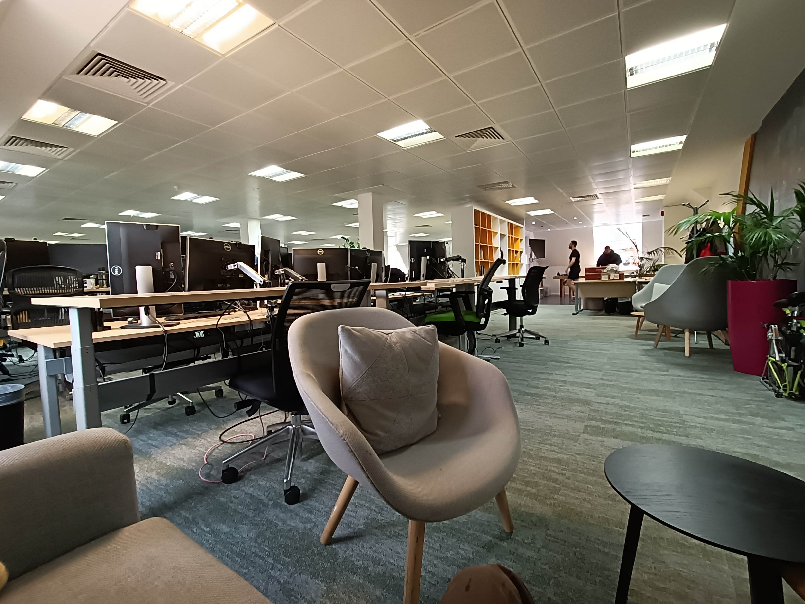
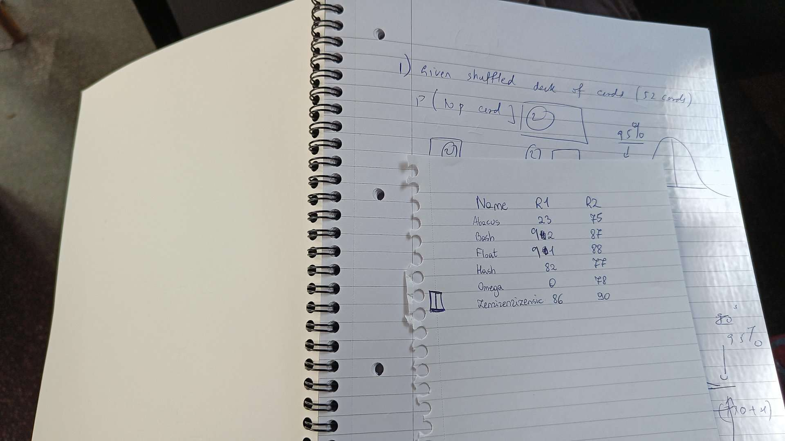

## Graduate Trading Operations Analyst

### Parameters

* Applied: January 21, 2022
* Interview 1: May 24, 2022
* Notification of failure: August 11, 2022
* Location: Hammersmith, London, United Kingdom
* Role: Data Scientist (was known as Graduate Trading Operations Analyst)

### Prelude 1: Choosing the role

The application process for this company required that I submit a cover letter and CV via email. Looking at the website, they had two roles that I found interesting, but did not know which one to apply for:

> Note that a screenshot of the two roles is provided as well, as they will take down the link when they are no longer hiring for that role.

* [Sports Quantitative Analyst - Graduate Level](https://www.mustardsystems.com/sports-quantitative-analyst-graduate.html) ([screenshot](../../../media/mustard3.png))
* [Graduate Trading Operations Analyst](https://www.mustardsystems.com/graduate-trading-operations-analyst.html) ([screenshot](../../../media/mustard2.png)). The Data Scientist role has exactly the same description.

So I sent an email asking a few questions so that I can make a decision. The response is published below in the hope that it helps others in the future:

<blockquote>

Hi Leader

I hope you are well.

Please find the below response, I hope this helps you make your decision.

> It is mentioned that a postgraduate qualification in statistics is preferred. How strict is this?

It is quite strict; having said that, at the end of the day candidate's experience matters, not their formal qualifications. If you think you have a strong background in statistics and probability, and you undertook some formal statistical training, feel free to apply.

> Also how much programming/computing is involved?

For quant, a lot, programming / computing / data wrangling are 80% of the job. Python / R are fine for quant though. For the trading operations, it would be closer to 50%.

> I was wondering on whether you could elaborate on what one would do in an average day

Some of the things you could be involved in  
a) Cooperate with quants - perform simple statistical analyses & data wrangling tasks.  
b) Cooperate with developers and traders - provide feedback on the trading systems & possibly oversee some - both performance as well as market / strategy interaction wise.  
c) Come up with trading signals.

> how much overlap (if any) exists between the quantitative analyst role and how much is different
> 
There is some overlap, the quant role would be more long term and speculative work; the trading operations role would be directly working on the intersection of market and data + some oversight over the deployed signals. The trading operations role also gives opportunity to work with multiple different teams early on.

Hope this helps.

</blockquote>

Indeed, that helped. For me, that meant that the better choice was the trading operations role, as the sports role seemed to require substantially more statistical knowledge than what I had, plus the trading operations role would allow me to be involved with the quant *and* the software development side, which would give me a lot of exposure quickly. And that's what I chose to apply for in the end.

### Prelude 2: The timeline

I got the impression that people were getting sick there all the time. Consider the following timeline (all emails were sent by HR):

February 1st:

> Please let me know your availability for a soft talk with our director, Tom Rolfe who will cover more information about our company, what we do and answer any questions you may have. The next step in the interview process will be a face to face interview at our offices with the Head of Trading, Matthew Waters and Owner of the company, Jasper White.

February 7th:

> Apologies for the delayed response. I have been sick with Covid. Please let me know what time works well for you this week. Look forward to hearing from you.

February 23rd:

> Unfortunately, our hiring team members are currently off sick with Covid so we have been unable to schedule you in for a soft talk. I will get back to you early next week with further availability.

March 10th (that was the point where they decided to skip the "soft talk" part silently):

> The interview will last approx. 1 hour and 30 minutes and will be with our Head of Trading - Matthew Waters and a Quant team member may join in too. You may have a second interview with the Owner of the company - Jasper White, at a later date.

The slots provided (March 16 and 17) were too close to my final exams, and hence I requested them to provide a slot after that.

March 10th (i.e, same day):

> We can do 29th - 31st March, 12 pm onwards - hope that works for you?

I asked a question about what the interview was (as that was only a few days after my final exams and I was not sure on how much (if any) I had to prepare). 

March 15th (this was responded to by another member of the HR team):

> [HR 1 name] is now on holiday. I am unsure if she responded to your question re the interview. The interview will include soft talk, general chat about his skills and experience, further insight into the role & projects we are working on / future projects we may explore etc. interview won’t last the full 90 minutes, we just say that to allow enough time. Nothing to prepare however will be asked technical questions based on mathematical skills. 

I felt that I would need a few more days (also I had other interviews during that time), and hence asked for a date and time after (and including) April 1st.

Come March 30th, and I didn't get a response. I sent an email asking for an update, and got this on March 31st:

> Apologies for the delay in getting back to you, I have been off with covid, first day back today. Re the technical skills, it is just maths questions, there is nothing of a technical nature. i will check with the team what their availability is for next week and the week after - can you let me know which dates you can make. Sorry again about the delayed response. 

The same day (before I responded to the previous email) I got this:

> Just an update re date options - Tuesday of next week is the preferable date, if not Wednesday might also work. 

After some minor clarifications from my end, the interview was scheduled for April 5th:

<blockquote>

Hi Leader

I hope you are well.

I can confirm your interview for Tuesday 5th at 11:30. Our address is 3rd Floor Mustard Systems, Colet Court, 100 Hammersmith Road, W6 7JP. Please ring the intercom (no.9) and ask for myself or [HR 2 name] & make your way to the 3rd floor using the lifts past reception.

The interview will last approx. 1.5 hours and will consist of the following -
1.	Introduction to Mustard and what we do as a business;  
2.	Understanding his background, education and interests - what they'd be most interested to do as part of their job;  
3.	Seeing how they approach problem solving: we will solve a few statistical exercises on the 1st year BSc Statistics / A-levels level (pen and paper might be useful for these);  
4.	There will be time for questions about the role, company and any other they may have.  
      Should you have any questions, please let me know.

</blockquote>

Note that I also asked about their dress code - they don't have one (which I appreciate). 

About ~150 minutes before the interview, I got this (while understandable, found that a bit annoying though I wonder whether that could have been a good thing):

> I have just tried to call you and have left a message to inform you that unfortunately, we are going to have to cancel your interview for 11:30 this morning as the lead interviewer has tested positive for Covid-19 so won't be coming into the office. I'd like to apologise for the short notice on this and will be in touch to reschedule your interview as soon as the lead interview receives a negative test result and is back in the office. 

Nearly a month later (May 3rd), I was told that the interviewer returned from sick leave and asked to submit availability for the coming week:

> Matt is now back from sick leave so please let me know your availability for W/C 9th May. Look forward to hearing from you soon! 

I replied the next day, but got an update only on 17th May:

<blockquote>

I do apologise for the delay in getting back to you. A few members of the hiring team have been unexpectedly and therefore this has delayed your interview further.

We are able to interview you any time next week - please let me know your availability for Tuesday - Thursday anytime after 11am.

There may be another stage after this interview, if successful, to meet the wider team. Look forward to hearing from you soon.

</blockquote>

Soon after, I was suggested May 24th at 11 am. Also worth noting: they do offer reimbursment, but only if one is coming from outside London (which hence made me ineligible) - though not only do I use a bus pass - the nearest TfL (Transport for London) station is, according to Google Maps, Kensington Olympia. This means that as I lived in Zone 2, I would be able to make a return trip (using a railcard discount) for £2.1 as of writing, and the bus pass (using an Oyster student photocard) averages out to ~£2.33 per day for me. I think this is reasonable and doesn't require reimbursement.

Fortunately, they did not make any further changes, and I arrived at their office about 35 minutes early on the day of the interview. It's about a 7 minutes' walk from Hammersmith Bus/Tube station. 

> **A note about toilets** (since it tripped me): the Hammersmith bus/tube stations are actually part of a larger complex, called as [Hammersmith Broadway](https://hammersmithbroadway.co.uk/plan-your-visit/). Unfortunately, they charge 50p for the privilege of getting your urine! This is not normally the case for TfL tube/rail stations. Fortunately, (free) toilets are available at the building Mustard Systems' office is situated in.

### The interview

As I appeared more than half an hour early, I was asked to take a seat first. The receptionist (HR 1) asked me if I wanted coffee, tea or water (multiple times), to which I declined (as I don't drink tea or coffee, and already had water) and also informally asked me on how I got to the office (I took the bus).

At 11 am, I was ushered in to the "boardroom", and the interview started. It should be noted that the Head of Trading joined remotely as he was feeling unwell (again?) - the room had a video camera like what one would see in a university. There was a member of the Quant team who was in-person alongside myself. Then the interview started. The first part was generally stock (why Mustard, what attracted me to the role, etc), and then not long after, the focus switched to the meat, which were the mathematics problems. They are summarised below:

* The first was about a shuffled deck of cards on a stack. Asked me to find the probability of getting a certain type of card, then asked me to find expectations, and after that told me to find a 95% confidence interval. The last part was the hardest for me and the only part in the interview where I required guidance, as I knew little about confidence intervals because I did not study statistics at university (only probability). I still managed to get the answer at the end, by combining what I knew from probability with the guidance he gave me (such as telling what it is). 
* I was given a question which was based on a very similar question from Chapter 4 of Heard on the Street. Are two bets with the same expected return the same? (the answer is no, because the variance has to be considered)
* There was a question regarding Sharpe ratio (which is related to finance; the definition was given) - I got it quickly by utilising properties of the normal distribution.
* There was another question about six dogs and two reviewers giving different marks for each mark, and I was asked several statistical reasoning question that felt a little ML (machine learning)-ish. For instance, one of the reviewers gave one dog a 0/100 - should this be ignored while summarising the data? And how? Why would a mark of 0 be awarded? And what mark should that dog have gotten?
* The final set of question was about betting horses. Given a model that predicts probability of a horse winning over another (say the probability of A winning over B being 0.7), and the data of the actual race (here A won), how one would check whether the model is accurate. A followup reduced the amount of information available (I think it was on how much information was available to identify the horse) which I could get as well. It should be noted that this question took time for me to understand and I did ask for clarification. This one felt even more related to machine learning.

After that, I was given the chance to ask questions. During the process of their answering my questions, I was asked a few more "stock" questions:

* The Head of Trading looked at my CV, and asked a question regarding my project. He used that to ask on how I would handle cases where I didn't know the information off-hand. I used the example of my undergraduate research in answering that question.
* I was also asked on how I'd react in cases of volatility - that is, what I'd do if I faced a case where I didn't know the underlying theory or concepts. 
* I was asked on my salary expectation. This isn't something that I care at this stage, and I flatly told him so. The role is what made me attract to this role after all. He remarked that it was a "good answer" - not sure on how "sincere" that was though.
* I was also asked a question regarding a Reddit post I wrote (which I think I linked on my cover letter)

And that was the end, in ~63 minutes. I did not know how well that went (given that the slot was for 90 minutes), but I felt that this was a role I would really like (especially because it is equally mathematical as well as computational). I was also told that they were in the process of interviewing with other candidates, and that I'd get to know whether I passed or failed in a few weeks' time (but isn't end-May already late as it is?). Perhaps surprisingly, I was allowed to take the 100-sheet (200 pages) notebook on which I was working out the mathematics problems with me - which I found surprising since I only used up about 5 sheets of it:

### Role change + take-home exam

On June 29th, I got this email which confused me, because the role sounded completely different:

<blockquote>

Dear Leader  
Thanks for your interest in Mustard Systems and for interviewing with us - the team really enjoyed meeting you. We have taken a few weeks to amend our interview process slightly & as part of the application process for the Data Scientist role, we require you to complete the Table of Bets test.

I have attached the documents down below. Please complete within a word document and send it back to us within a week.

Please can you also confirm your salary expectations? Look forward to hearing from you.
</blockquote>

There was 

* a Word file detailing the take-home exam specification
* a CSV file containing the dataset

The take-home exam ("Table of Bets") gave a dataset of fictional (but realistic according to them) horse bets and asked me to summarise the data, find out subsets of the dataset where it would be a good idea to bet (providing relevant statistical parameters such as confidence intervals), and determining whether a new bet should be staked. Knowledge of statistics and probability (to an introductory level) is expected. I did the exam over the weekend and submitted it back to them.

They also mentioned that the salary range is £40000-45000 upon my asking (which easily met my standard; I am not particularly motivated by salary). They also clarified that the role change was only in name and that the duties would remain the same - and indeed the job description was otherwise identical.

### Notification of failure

More than a month later, I still had no idea on whether I passed or failed the exam. So I emailed (HR 1):

<blockquote>

Dear [HR 1],

Do you have an update on my application? It’s been nearly a month and a half and I have no idea on how well I did.

Regards,  
Leader

</blockquote>

3 minutes later, I got the failure email:

<blockquote>

Hi Leader

I hope you are well.

I presumed you would've received an email directly from the team as they had assessed your application over 20 days ago. Apologies if this has not been the case.

Unfortunately, your application has been unsuccessful. Your submission did not meet the required standard for this role and therefore we will not be progressing your application.

We wish you all the best for the future.

Kind regards,  
[HR 1]
</blockquote>

This was frustrating (and no, I got no email from them). I immediately asked for feedback:

> Can you elaborate on “Your submission did not meet the required standard for this role”? In particular, what was incorrect with my submission (which I am assuming to be only the take-home exam)?

... and waited for a week. I was not particularly hopeful given that it's common for companies to not respond to requests for feedback from my experience. But then they did reply a week later:

<blockquote>

Hi Leader

I have pasted your technical feedback below as requested - I hope this helps clarify. As mentioned, we have kept your CV on file should you wish to reapply. All the best for your future endeavours.

I like the exposition, it is clear and easy to follow Leader's thought process.

The main concern is that looking at each variable in separation (e.g. going, distance) is not enough. What we really want is to build a model which predicts a bet's profitability given a game's and state's attributes (e.g. going, number of runners, race type).

I'd also be interested to see an analysis of overall profitability - where we would summarise the strategy's overall profitability, its Sharpe ratio, how consistent it's been, etc.

</blockquote>

This is pretty good feedback. It clearly tells what they liked about my submission, and what they felt was lacking. The problem is I am not entirely sure how I could have figured that I had to do _that_ - were they hinting for someone who have had prior experience in this context or do I just lack the competence to figure that out?

### Takeaway

* I think they could have handled the initial stages better. They often took way too long to respond, citing reasons such as someone getting COVID. But then can't they WFH (work from home)? Officially they mentioned that they are on hybrid (60:40 office:home) (unless that was outdated), which makes their delay even more puzzling. I'm similarly surprised by them cancelling the interview because of one person being sick - clearly they could do it hybrid as that person was sick on the day of my rescheduled interview but joined remotely. Why was that not done for my April interview? Ideally, they'd be more flexible with things such as remote working, but that's not a necessity for me. The response when I asked about their in-person preference was generic and not convincing. 
* Other than that, they handled things OK, except for the fact that they were just too slow and I'm not entirely sure who would pick this company as a result. Consider their salary for instance. £40000-45000 is fine to me, but consider their target group (which is pretty elitist). Most would be better than me, and I think it is reasonable to guess that the majority would get (multiple) offers, and given that the median salary at my university is around the £45000 mark, many would get one with a significantly higher salary. The question would be - why pick this company then? I seriously doubt most candidates of the calibre Mustard Systems is looking for would be willing to wait this long.
* My 100% failure on take-home exams is something I've been struggling to make sense of (never passed such a test). I do just fine on LeetCode-based exams after all. In many cases (including this), it can be traced down to a form of "I didn't know I had to do _this_", but then it seems like assumed knowledge. I plan to use this failure as a learning exercise, now that I have an idea on what I should have done. This is pretty frustrating to me, given that I don't normally see cases of people doing well in "time-boxed" exams such as LeetCode-based entrance exams but flunk in take-home (i.e, untimed) ones.