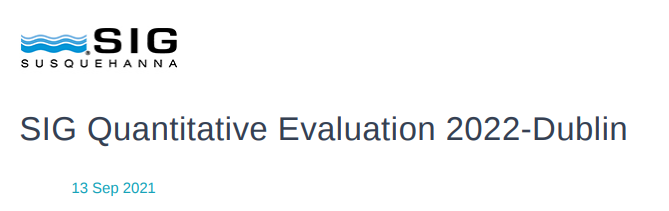
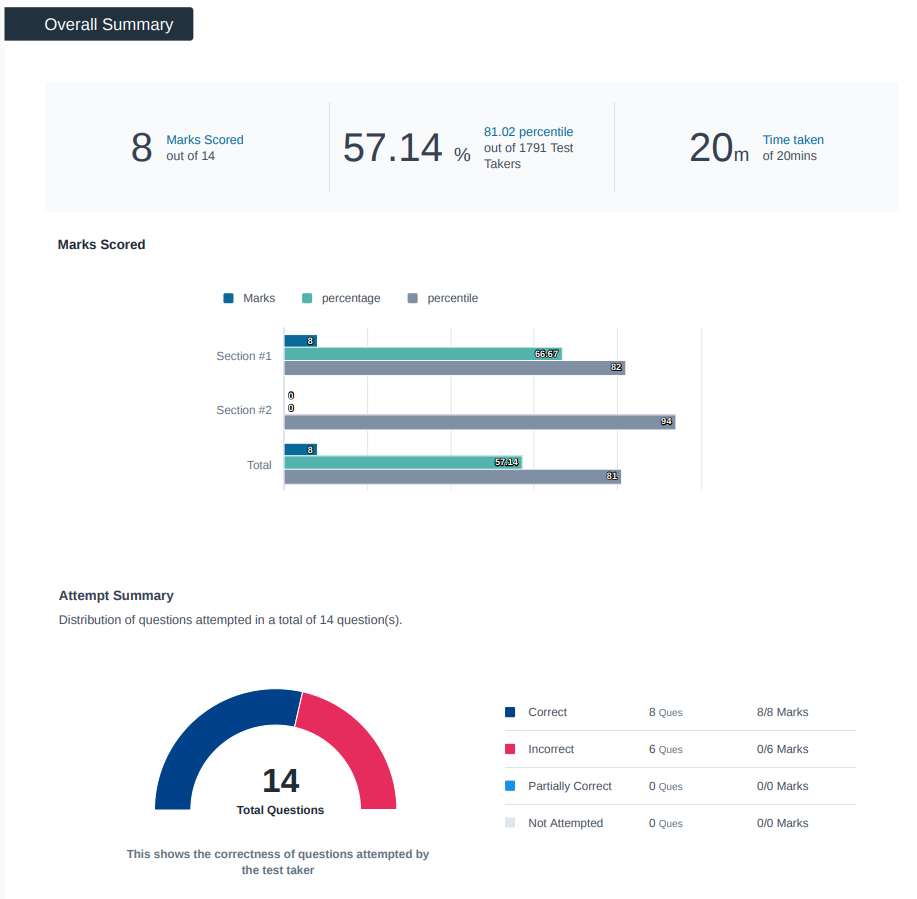
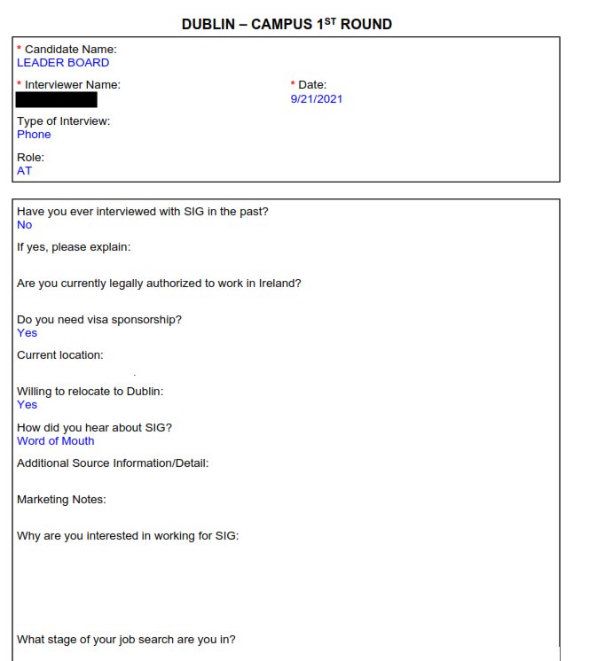
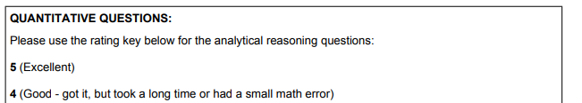
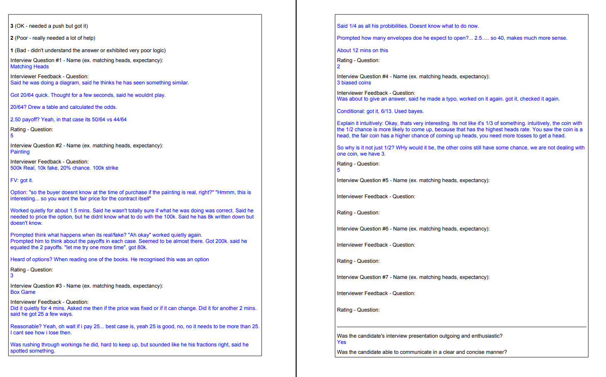
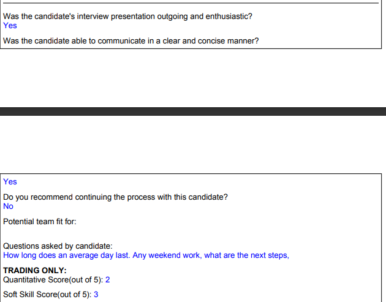
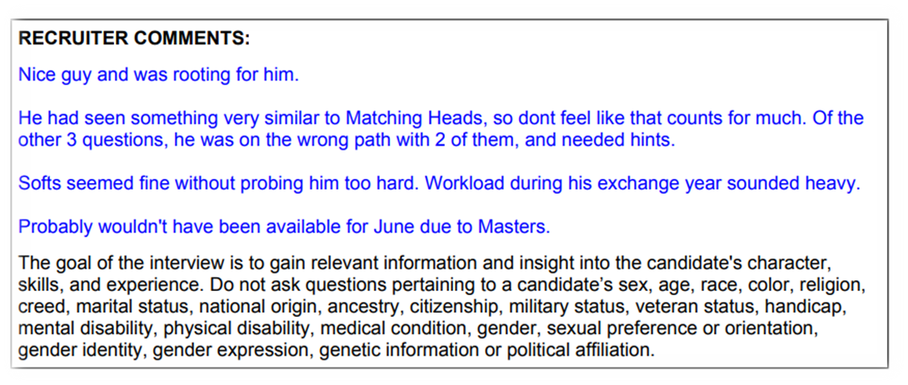

## Quantitative Trader - 2022 Programme

### Parameters

* Role: Quantitative Trader - 2022 Programme
* Location: Dublin, Ireland
* Applied: September 13, 2021
* Notification of failure: September 29, 2021

### Mathematical entrance exam

This does not appear to be automatic, though I'm not sure on whether everyone gets it. 

The exam contains 14 questions of a mainly probability nature (with a focus on expectations) and a couple of brain-teasers. While the questions are not particularly hard themselves, there's only 20 minutes in total, so one is likely to be pressured for time. Example questions would be finding the expectation of a particular infinite stream or finding whether a particular bet is good (which would involve comparing the expected value with the value of the bet). The questions were a mix of MCQ and fill in the blanks (usually an integer). 

### Round 1 interview

This was with a recruiter from HR. Notice that while they are from HR, they usually have significantly better mathematical understanding that average (in fact, their application for a recruiter wants potential candidates to have done coursework in mathematics). 

The interview was a split between stock (non-technical) and probability-based questions. I was served five probability questions (again focusing on expectations, through there was one on Bayes' theorem). While I did get them all, I had to request hints for a couple. Preparing from quant guides such as Heard on the Street or similar should help. To give more details on the questions themselves (helpful when reading in conjunction with the interview feedback - see the GDPR section):

* The matching heads problem was given a set of three tosses with a certain probability and given a bet (say getting 3 pounds if two heads and a tail or 0 otherwise) and you pay some money to take the bet, whether this is a good bet or not. The solution would involve drawing up a table of probabilities for that scenario and computing expectations.
* The "painting" question was given a scenario with a particular chance of the painting being real and that being fake, what is the expected value of the painting (again taking expectations); there was a harder variant which I didn't do as well (and hence got a 3)
* I can't recall the box game as well (the question was to find the expected number of boxes to open if I'm right; can't recall the scenario)
* The last question ("3 biased coins") was a standard Bayes' problem; was something like given a fair coin, a coin with only heads and coin with only tails (or something like that with different probabilities), if you pick a random coin and it's head, what is the probability it was from coin 2?

The non-technical portion was generally standard with some tricky questions. While the classic ones (why SIG, why quant) were asked, tricky ones included:
* how I did "so well" in my undergraduate - while I had a first, it was a very low first and that isn't a case of "done so well" given that getting a first isn't impressive _at all_.
* what my research supervisor would tell about me

### Notification of failure

Was by email. A request to feedback did not elicit a response (this was despite them explicitly telling at my Round 1 interview that I'm free to ask for feedback). When I asked them later about this at my university's career fair, I was told that my interviewer was on leave then and would come later. I didn't ask again after that.

### Getting the interview performance using GDPR

_Written on April 8 2022_

I was not convinced that contacting them again (and possibly being ghosted again) was a good idea, so decided to take the GDPR route instead to see what I could get. So I made a standard GDPR request:

<blockquote>

Hello,

I would like access to all of the recruitment data you have (specifically the ones used to make a decision on my application) with me with respect to the Quantitative Trader - 2022 Programme role. This includes the scores I got on the mathematical entrance exam I had to do as the first stage, and any feedback for the interview I subsequently did for this role.

This is a formal GDPR request to access this data.

Regards,  
Leader Board

</blockquote>

I got this from someone who works at SIG's legal team 6 days later:

<blockquote>

Dear Mr. Board

I just wanted to let you know that we are in receipt of your request and are working on it. We will respond within the required timeframe.

Yours sincerely,

[human name]  
SIG  
International Centre  
IFSC  
Dublin, D01 T6T0

</blockquote>

A week from that, I got this, with two attachments which will be described below:

<blockquote>

Dear Mr. Board,

Please find attached the recruitment data requested. I have redacted the name of the interviewer as it is not your personal data.

Yours sincerely,

[human name]  
SIG  
International Centre  
IFSC  
Dublin, D01 T6T0

Tel: [a phone number]  
Direct:[a phone number]

</blockquote>

I found the mention of them redacting the interviewer's name funny; after all, I already know their name! 

Now, for the attachments. 

The first attachment was my entrance test _in full_ (notice that I only requested the scores I got on the test, but they provided the questions as well).

> Repository policies preclude sharing the questions themselves - they are most likely recycled after all.

Even better, there's useful statistical data on my overall performance!

... and is useful data for those trying to figure out how well they need to do. And yes, I really did do that poorly. 

Now for the second one:

> I have had to redact some of the sections. The portion on soft skills cannot be shared publicly because it contains more personal data than I'm willing to share here, unfortunately.

They said that these were notes - and they are. For instance, the answer to the job search stage (and more) was paraphrased by the recruiter!

And it gets better. Here's the section on my interview performance:

That's some seriously good interview data - giving a very good insight into what I messed up on and the few bits I did well. 

And here's my overall performance:

This alone was enough to convince me that it was my poor mathematical skills that caused me to fail, given that I did better in the soft skill section (which is very rare to see given that I normally fail in those parts an interview). Kind of bittersweet I'd say - bitter in that it was a technical failure (which is disappointing to see given that I try not to get them) - but sweet in that I got a lot of good insight on _why_ I failed. The one problem is that they did not explicitly mention that - notice that all they said in the "do you recommend" part was a "No". 

But that isn't all. Here are the "recruiter comments":

<blockquote>

**RECRUITER COMMENTS**:

Nice guy and was rooting for him.

He had seen something very similar to Matching Heads, so dont feel like that counts for much. Of the
other 3 questions, he was on the wrong path with 2 of them, and needed hints.

Softs seemed fine without probing him too hard. 
Workload during his exchange year sounded heavy.

Probably wouldn't have been available for June due to Masters.

The goal of the interview is to gain relevant information and insight into the candidate's character,
skills, and experience. Do not ask questions pertaining to a candidate’s sex, age, race, color, religion,
creed, marital status, national origin, ancestry, citizenship, military status, veteran status, handicap,
mental disability, physical disability, medical condition, gender, sexual preference or orientation,
gender identity, gender expression, genetic information or political affiliation.

</blockquote>

When I first opened this PDF, I actually went right to the end of the document, trying to think of what bad things they had to say about me. So seeing this instead was a shock, and I still cannot figure out if the recruiter's first sentence was meant to be sarcasm or not. Again, the one issue I have with this PDF in general is an _explicit_ confirmation that "this" (like my poor mathematical skills) caused my failure, and adding comments about my masters program confused me since I could not tell if _those_ played a factor in my failure (if I had a 4/5 in the mathematics section, I would have looked at that more closely in my writeup).

Still, this is the **best** failure data I've ever gotten as of writing in my four years of applying, and I think that means something (well done SIG for providing this, but also shame on them for making me have to take the GDPR route, as I certainly wouldn't be able to get this if I applied for a US role). Is it really hard to give this data to every candidate? In my opinion, no. I mean, in a way I've gotten more respect for SIG because I implicitly know why I failed (and how well I did), instead of having to make guesses (which as it turns out wasn't true).

### Takeaway

This one stung. It is hard for me to find a role that I am really interested in, and I thought I did OK in the interview. I think my mathematical skills are still not at the level of what they should be (which is likely) or that I somehow messed up in the non-technical portion (also possible). Hard to be certain without feedback. Long way to go it seems.  

**Update**: sadly it turned out to be a weakness in my mathematical skills; yes, long way to go indeed. And GDPR is kind of a gem - it can amaze me at times as to how much (useful and insightful) data companies will release with it.