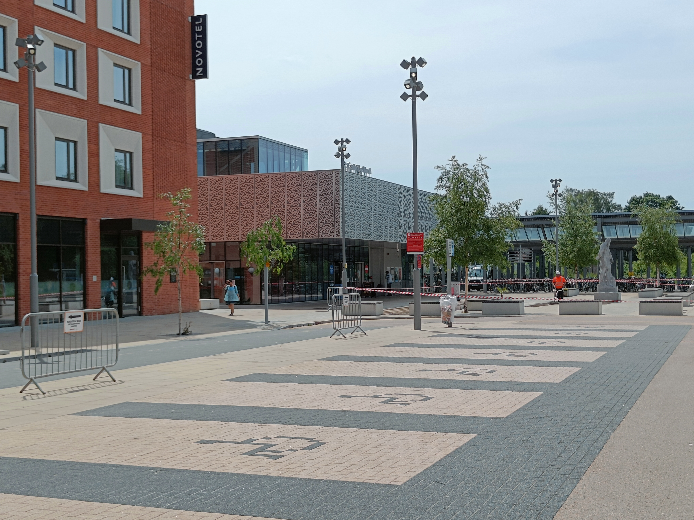
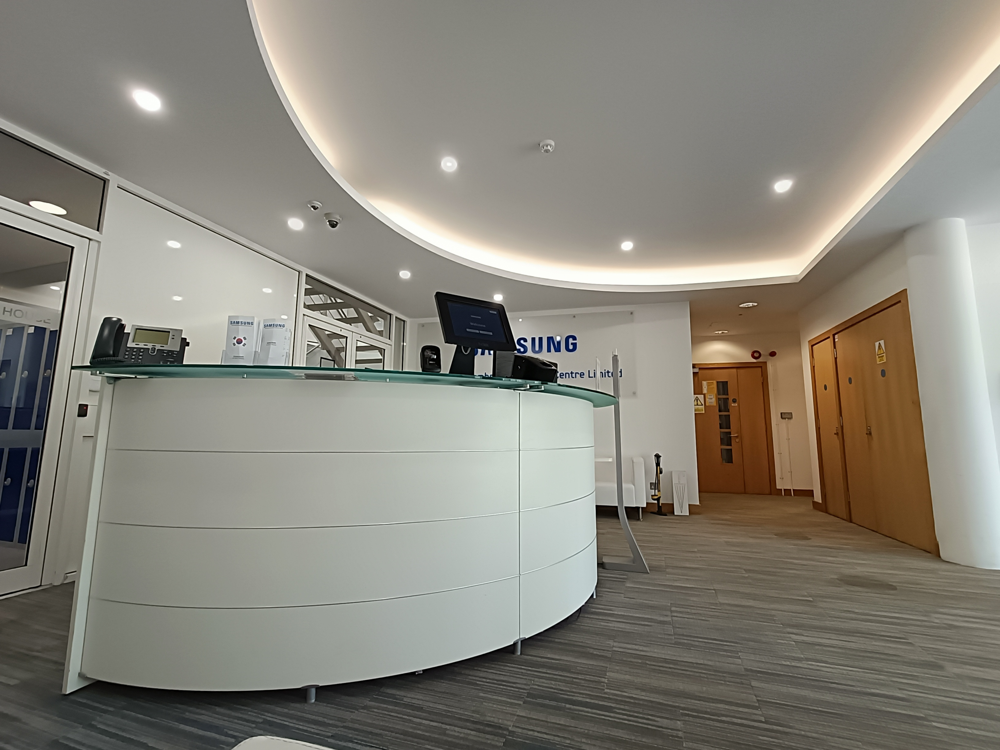
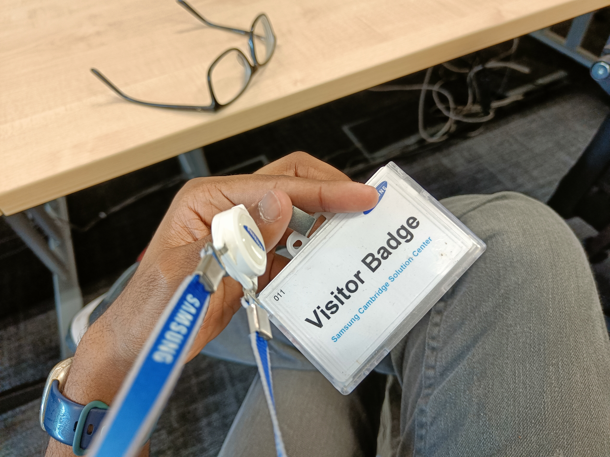
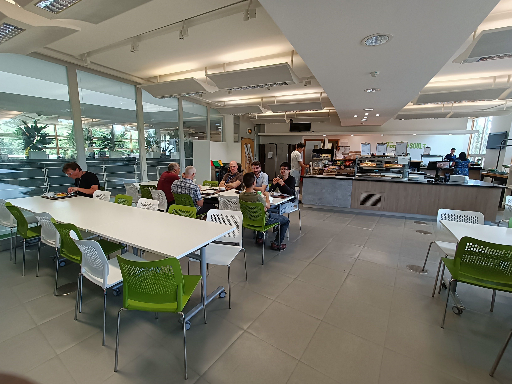
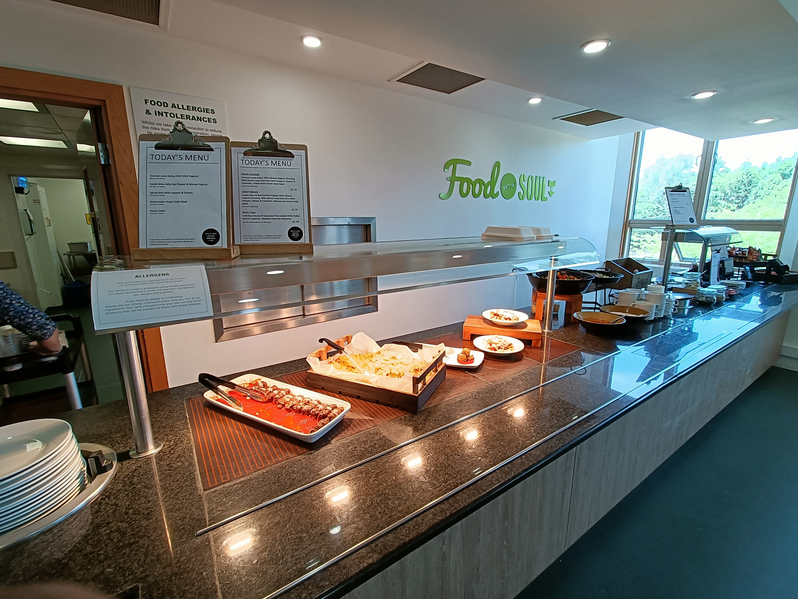
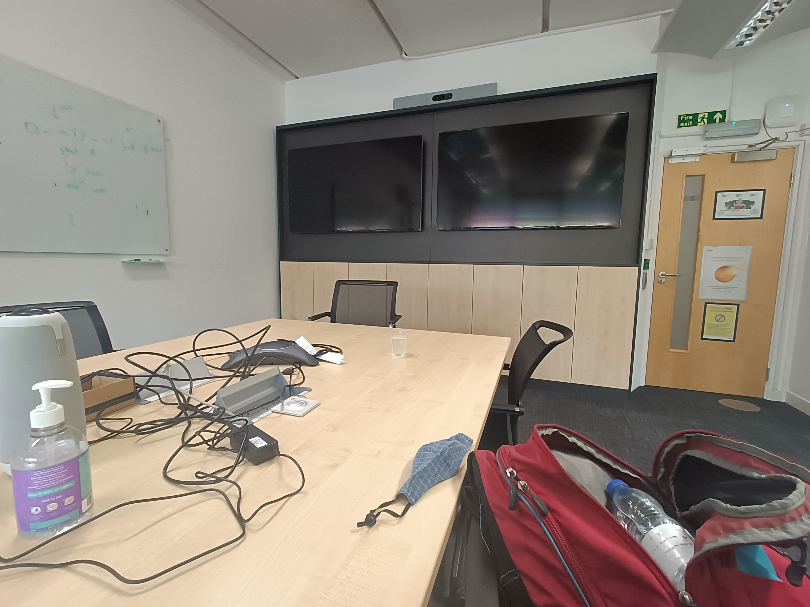

## Graduate Embedded Software Engineer

### Parameters

* Applied: April 23, 2022
* Round 1 interview: May 5, 2022
* Round 2 onsite: June 16, 2022
* Notification of failure: July 12, 2022
* Location: Cambridge, United Kingdom
* Role: Graduate Embedded Software Engineer

### Coderbyte entrance exam

After submitting the application, I was asked to take a Coderbyte entrance exam in C. It was a LeetCode easy and LeetCode medium, rather similar in scope (strings and working with binary). The test was untimed, making the process less stressful, but had to be completed in one sitting The main challenge I had was translating what I'd normally do in Java into C, given that C has very few library functions. Note that Coderbyte will run a few sample test cases, but once submitted, will run some hidden test cases but won't tell your score (so testing with custom test cases is important, like Codility). 

### Phone interview

After that, I was asked to set up a phone interview with two people.

<blockquote>

Thanks for scheduling a Telephone Interview for the Graduate Embedded Software Engineer position at Samsung Cambridge Solution Centre.

You will be meeting [person 1] and [person 2].

The interview is scheduled for 1:30pm on Thursday 28 April 2022 (British Summer Time). It should last 30 minutes.

Your telephone interview will consist of a conversation with the hiring manager. They will review your application, get to know you a little better, ask you some competency-based questions in relation to your skills and experience. They will also give you the chance to ask any questions about the role (or about working for us in general).

</blockquote>

Unfortunately, the first time it had to be rescheduled with short notice "due to unforeseen circumstances". Now, only one person showed up for the phone interview (not via a video conferencing medium). The interview roughly went like this:

* First, the classic stock questions (why I applied here)
* It seemed that the interview was not as planned as one may expect. So to give an example, when I said that I was interested in concurrency and multicore architectures, I was asked to tell what I knew about it. Then I was asked to tell what factors are important in an embedded device (such as power), and his follow-ups were dependent on what answer I gave to his previous questions.
* The questions were in general broad and deep. The main parts I could do OK were in architecture and concurrency. The ones I mainly struggled in were in networking (since I barely studied any networking at university) and hence I struggled with questions that asked me to describe what exactly happens when, for example, I go to a particular website (hint: the answer is not as simple as it may seem). 
* I was also asked many questions about things such as what I knew about C (such as how hard I found the entrance exam), SWE principles such as agile (almost nothing, since I never had an internship) and whether I was a "team player".
* Then I was given the chance to ask questions, and that was the end in about an hour (excluding a few minutes' delay due to some network issues)

However, the interviewer seemed to be aware of my lack of formal experience with networks and appeared to take that into account, as I ended up _not_ failing the interview.

### Getting the onsite

About 19 days later, I was sent this:
> Following your successful telephone interview, we are pleased to confirm that we would like to invite you to a First Interview for the Graduate Embedded Software Engineer position you have applied for with us at Samsung Cambridge Solution Centre.

What confused me was that they said it was a "first interview" given that I had already did one. An email cleared this up:

<blockquote>

Thanks for your email. Apologies if the wording was confusing, the interview stages for us are:
- telephone interview
- first stage
- final stage

This is the largest part of the interview process and will take approximately 2 hours and we would like to invite you onsite. The final stage is a short video call (30 mins max).

Hope this clears things up.

Kind regards,  
[HR 1]

</blockquote>

OK, so that's the (virtual) onsite. I scheduled a date, and got this:

<blockquote>

Thanks for scheduling a First Interview for the Graduate Embedded Software Engineer position at Samsung Cambridge Solution Centre.

You will be meeting [HR 1], [person 3], [person 4], [person 2], and [person 1].  
Your interview will take place on Thursday 26 May 2022 and consist of 3 parts, split as follows:
* 1:30pm (British Summer Time) - HR Interview - 30 minutes
* 2:00pm (British Summer Time) - Technical Interview - 60 minutes
* 3:00pm (British Summer Time) - Hiring manager(s) Interview - 30 minutes

Your interview will consist of three sections:

- Interview with a member of the People Team (30 mins)
- Technical Interview with the hiring manager and team (1 hour)
- Interview with the hiring manager(s) (30 mins)

This will be a video interview on webex, please keep an eye out for the video link invite in a separate email.  
We've attached a calendar event to this email.
</blockquote>

OK, so looks like a three-stage virtual onsite for two hours. I booked a suitable room at my university in preparation for the event.

The day before the onsite (at around 9 pm), I got this strange email which confused me (and prompted an immediate response from my side requesting clarification):

<blockquote>

Hi Leader

Hope you’re well.

I am looking forward to seeing you tomorrow for your interview, I just wanted to remind you to please keep a hold of your receipts as we can reimburse your travel expenses.

Just a tip as well, if you get a taxi to the office the drivers often take people to the wrong building on the innovation park as there is another building called St Johns Innovation centre. We are St Johns house, right at the end of Cowley Road. If they do drop you off in the wrong place we are just next door though 🙂

The full address for the office (just in case you need it again) is: St Johns House, Cowley Road, Cambridge CB4 0DS.

See you tomorrow afternoon!

</blockquote>

It was strange because nowhere was I told that the onsite would be in-person. Both the invite email and what I was told at the phone interview implied that the onsite would be virtual. I couldn't tell at that stage whether the onsite was actually supposed to be in-person or virtual. Turns out that it was indeed in-person, and I got the confirmation at ~11 am on the day of the interview:

<blockquote>

Hi Leader,

My apologies, I have just checked our system and have realised the wrong interview invite template has been used! You should have received an invite for you to attend your interview onsite. This is our admin error, I am so sorry about this.

I understand if this is too short notice for you attend this afternoon as you would need to make travel arrangements. We can rearrange to 9th June alternatively?

</blockquote>

Indeed, a rescheduling was inevitable. It was not feasible for me to travel from South Kensington to Cambridge at this short notice, and even if I were to leave right then, I would barely reach their office. Indeed, I agreed to 9th.

Turns out that wasn't enough. Unfortunately, I found out that I caught COVID on 6th of June, despite being triple-vaccinated. While legally I am not required to self-isolate, to do that (given that I would be travelling though the tube and National Rail) would be grossly irresponsible at best, and is not something I would be willing to do. The government guidelines suggested self-isolating for five days following the date of getting the positive test result, which meant that the earliest I could do the interview was June 12th. I immediately emailed [HR 1] and even tried calling her many times, but ended up getting the voicemail. A couple of days later, the recruiter responded and offered to set up the interview for 16th. That would work out for me.

On the day, I took the train to Cambridge North (*not* Cambridge), and from there, it was a 20 minutes (2 km) walk to their office. While I could have taken a taxi (which I would have been reimbursed for), I did not find that necessary here.

Upon arriving at the place (which I did about 57 minutes early), I was asked to wait. I asked on if there was a place I could have my lunch (which I cooked in the morning and brought with me) - to which I was told that I could go to the canteen. That seemed busy with employees having their lunch (they are given about £4.7 of allowance every day, and even the food/drinks were clearly discounted), and I was explicitly told that I was allowed to take drinks from the machine. 

> Note: be careful with which glass you take! I took one that was too small and did not know how to stop the machine from overflowing, which was a mess to clean up and also nearly burned my hands. 

After that, I waited till [recruiter] arrived. It should be noted that they did not realise that I would come an hour early - I was told that they would have allowed me to have lunch there (i.e, without my having to cook beforehand). Also turns out that one of the interviewers had changed - someone else covered for them as the original interviewer was not able to come.

Some pictures

Alternate text should provide necessary context wherever needed.

### The onsite

The first part was with [recruiter]. I was first given a high-level description of the company. Then I was asked questions such as 

* what made me apply to this role
* what I was looking for in a role
* what I foresee would be my "greatest" challenge and strength that would apply for this role
* whether I had the right to work (they require internationals to take the post-study work visa route) and whether I was fine with their hybrid working policy.

Then I was given the chance to ask questions, and I was told about the salary (starting at 38,500 pounds) and benefits at the company. 

The second part was with [person 3] and [person 2] (who was covering for [person 4] who could not arrive). 

* I was asked on what I knew about embedded devices
* The two noted that my CV had no industry experience, and I was questioned on things such as teamwork and how I worked with my supervisor (when I did research). They explicitly noted that academic research is different from industrial research. I was also asked to foresee the challenges in working with teams and in a group environment. 
* I was asked on what my career aspirations (i.e, what I wanted to be) - I don't know where I would be in a few years' time!
* I was given a whiteboard problem on linked lists. First asked on whether I knew what a linked list was, and to give an example. I was then asked to sketch code for adding and removing (in a singly linked list context). Was also asked briefly about the advantages and disadvantages of doubly linked lists. 
* I was asked questions on how I would handle resolving a problem, and what debugging techniques I'd use in the process. 
* I was also asked to tell the difference (if any) between ``const int* a`` and ``int* const a``. 
* I was given the chance to ask questions (was told that they had 12 spots in the overall graduate scheme, with two left when I interviewed)

After that, I was given a tour of their office (which I found interesting and a pleasant surprise) - unfortunately was not permitted to take pictures. Contained things such as phones and laptops being tested (with custom firmware) with routers and other networking equipment. The last part was with [person 1] and [person 2]. Involved more quizzing:

* was (again) asked on why I had no experience in industry (i.e, no prior internships)
* was asked to describe two projects
* was asked on my understanding of multi-core and concurrency (this was mentioned as a module I took at university). In particular, I was asked to describe (in detail) a practical coursework I had to do, and was asked questions on what challenges one would face in a concurrent environment, and what differences exist when multiple threads run in a single core (as opposed to multiple threads running in multiple cores).

And that was it, recall finishing at about 4:50 pm. Was offered drinks from the canteen before I left, I just took a couple of packed 200 ml orange juice drinks. 

Regarding the reimbursement: they told me that I could fill the form on the day, or [recruiter] could email me and I can fill it and submit (within 3 months of the interview). I opted for the latter, and indeed they reimbursed the money via bank transfer in about a week and a half. No issues there.
### Notification of failure

They said that they would notify me within two weeks - but took nearly a month in the end.

<blockquote>

Hi Leader,  
Thank you for coming in and meeting with us.

I spoke with [interviewer 1] and we’ve decided not to move forward with your application, Please see below feedback as to why we will not be progressing with your application.  
You have very good technical skills and seem very keen to learn new skills. You have a good understanding of embedded programming even though you do not have experience in a related field.
* We are looking for someone who is keen and passionate about embedded work and wants to focus on this. During our interview you expressed you were unsure if you wanted to focus on embedded software.
* In our opinion, you appear to be looking for a research orientated algorithmic role which does not fit the requirements of this role.

Thank you for spending the time in applying for our vacancy, we wish you luck in finding your next role.  
Thanks, Samsung Cambridge Solution Centre

</blockquote>

Their providing of written feedback was a pleasant surprise - I've never had a company do this to me before! Their feedback is also meaningful and relevant - if they are looking for someone who is absolutely sure that they would stick with embedded for the rest of their life, that's not me. I don't know what I would do after a year or two - my life is uncertain as of writing. Their second point also makes some sense upon retrospection - what they are saying is that they think that this role isn't a good fit for me - and that's understandable.

### Takeaway

* Overall, good work from the company.  The company handled stuff professionally and treated me reasonably well (such as when I had COVID). Unlike my experience with other companies, they tried to make my in-person visit useful (even if I think they could replicate most of it virtually), for instance by providing drinks and having me tour their office. The only issues were relatively minor - such as the initial mishap of the interview setting which required a rescheduling - and the recruiter taking longer than normal at times. I would encourage future candidates to consider having their meals at the company restaurant - just ask the recruiter - if I knew that was a thing I would have! 
* The fact that they provided useful feedback in a written form is a first for me and well appreciated - and in fact serves as a model for other companies. It's not that hard!
* This is a role where LeetCode isn't necessary to do well - knowledge of fundamentals is more important (and what I learned from university was enough for me to do well on the technical part). 