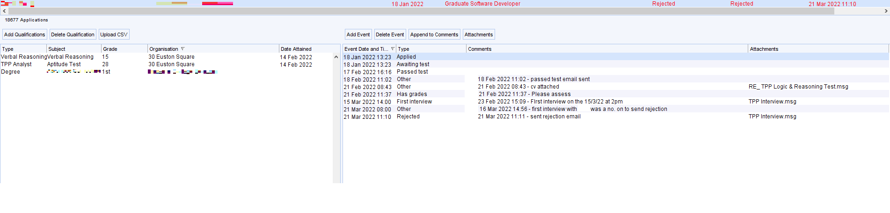

## Graduate Software Developer

It should be noted that this includes in-person elements, and hence will include sections which may reasonably be construed as off-topic from a job application perspective. I also interviewed with them back in 2018 (for an internship role), and hence some description and comparisons will be made regarding that experience. 

Some effort has been made to hide the off-topic elements by default through use of drop-downs, which readers can use to see those parts of this write-up.

### Parameters

* Applied and booked the examination: January 18, 2022
* Sat the entrance examination: February 10, 2022
* Interview date: March 15, 2022
* Notification of failure: March 21, 2022
* Entrance examination venue: Euston, London, United Kingdom
* Interview and job location: Horsforth, Leeds, United Kingdom

### Prelude

TPP is one of the most bizarre companies I've ever seen in my years of applying to hundreds of companies, and it starts right at the application process. Unlike every other company I've seen till date, they want you to sit an **in-person** entrance examination to even be considered. 

I was outside the UK from mid 2019 until January 2022. Naturally, I had asked TPP in 2019, 2020 and 2021 on whether there was any way they could waive this requirement (especially since I did pass their test back in 2018 - described later on) or give me an alternate test form (even proctoring would be fine). In 2019 they flat-out refused. In 2020 they silently rejected me. In 2021 they refused my request. Indeed - they were forcing candidates to sit in-person exams, even at the height of the pandemic! I have had people tell me that they were forced to travel to sit the examination even at times such as January 2021 (when the UK was in a Tier 4 full-blown lockdown) - in fact I would consider this as skirting the law - because what did they claim that allowed them to do this?  

<blockquote>

**Are you still doing Logic and Reasoning tests during lockdown?**

Yes, due to us being Key workers we are able to run our Logic and reasoning tests during lockdown. You can book a test at various locations around the UK or at our office in Leeds. We continually add more dates so keep checking back if there is a venue or date you’re interested in but has no availability.

</blockquote>

"Key workers", really? Indeed, I found this so ridiculous that [it deserved its own Reddit post](https://www.reddit.com/r/recruitinghell/comments/kxzwo0/having_inperson_only_tests_despite_lockdown/).

Now, on to booking the entrance exam. Firstly notice that they only have about 15 centers - biased towards the location of elite universities (and none in Wales) - in the whole of UK. While I think it's impressive that a company can set up that many centers, the fact is that people living outside these regions face a potentially long travel, at their own cost. 

In my case, I looked at the centers at London. There were two: 

but the Oxford Circus one didn't seem to be running, as they never seemed to have slots available. While there were slots for the Euston center, so I booked one for 7th February. It should be noted that the impression I had was that the London slots were quite popular - I booked about 2-3 weeks back and there were very few seats for that date - while some others seemed to be relatively less popular. Once I did that I got an automated email confirming that I booked the test.

Another thing worth mentioning: they only want people that have _at least_ A-Level grades of A* AA, with an A*  mandatory in Maths. This means they implicitly only want people from relatively elite universities (+ are taking a STEM subject), and sounds like a ridiculous and elitist policy to me (especially given the A*  requirement which is quite high). It's not that the test (or the role) requires anything that demands such a high grade. I should note that I didn't take the A-Levels, but I have a sufficiently high mark in Maths to be comfortable applying for a role that wants an A*. 
### The entrance exam

On the day of the test, I reached the test venue via the Underground's Victoria line to Euston (which is also reachable though the Northern line, and is near to Kings Cross and Euston Square which are served by other lines).

Some description about the building and the testing room

The below picture shows the front of the test venue:

I went through that entrance, but was asked to go through a different entrance. When I tried to do that, I was asked to go back to this (front) entrance! Then I explained why I was here for and then was let in. It should be noted that I arrived about 45 minutes early despite TPP telling me not to come more than 15 minutes early - this is because of lack of familarity with the area (and I'd rather be too early than too late).

Now, about 15 minutes later, a woman came who would be the invigilator for the examination. Out of curiosity, I asked her who she was. She responded that her name was [redated], and that she was _not_ working for TPP, rather she works as an independent invigilator for exam boards such as the A-Level (and companies like TPP). It should additionally be noted that despite the impression from the website that the room would be packed, this was not true at all - it was not more than half full at any given time. Clearly, many decided not to show up, which made sense to me.

There was also an annoying "whirring" noise in the room (probably the heater) - given that I was the first to come in, I was given full choice on where to sit, but the noise could be heard no matter where I sat in the room. An audio recording showing the noise is available [here](../../../media/tpp2.mp3).

Now, about the test paper itself. Firstly, note that I can only describe the Logic and Reasoning test which I had to do for this role - there are separate entrance exams for other roles such as Business Analyst and roles asking for knowledge of Mandarin. The test itself had about 50 questions for 60 minutes, and comprised two sections:

> The questions itself in the below screenshot have been redated per repository policies (also they clearly recycle this test for other candidates).

* a _verbal reasoning_ section, which I thought was unfair for non-native English speakers (also I thought I was taking a logic and reasoning test?). I think I did OK in the end though as a non-native English speaker. The presence of this section surprised me because nowhere in the website did they indicate that there would be one. 
* a "logic and reasoning" section. This comprised multiple MCQs covering logic (such as deductive reasoning, completing the sequence etc.) and some mathematics (such as elementary probability). 

The test itself is fairly fast-paced, and it is easy to feel time-pressured. My strategy of "multiple passes" (that is, starting with the questions I found most comfortable, then returning back to the trickier questions) worked well for this test. This test is also malleable to techniques I use in some other MCQ exams, such as elimination and educated guessing. There is no negative marking for this test, and calculators are not allowed (or required); this is a strictly closed-book and closed notes exam. The noise was quite annoying though (as someone with sensory issues).

    
The test in 2018

When I last sat the exam in 2018, the logic and reasoning test was similar (and there was some overlap), but there was no verbal reasoning. 52 questions in 60 minutes. I sat the test at a room in the university I was at then (not in London). 
 

Anyway, once the test was done, the papers were collected and that was the end for this stage. 

### Proceeding to the next stage

Notice the above: they put a "P", presumably a pass, and two numbers, which are the scores I got on the verbal and logic part of the exam.

I was told at the examination venue that they don't have a "pass" mark and that the performance is compared to other candidates (which I'm not quite sure is the case). In my case, turns out I did not fail the test, and I was notified of the same via email a few days after sitting the exam. This is not completely surprising because I normally do OK in these tests (plus passed the 2018 variant of the exam), but I know of some otherwise strong candidates who didn't, and that surprised me because they are clearly better than me academically (and in other aspects).

I was asked to call a number to schedule the interview date, which I did. I was offered a morning (10 am) and afternoon slot (2 pm). I chose the afternoon slot mainly because I would be travelling on the day, and didn't want to risk being too late (because if I were to take a morning slot, I would have to leave ~6 am at the latest which is risky). The interview is at Horsforth in Leeds, and they do not offer any remote options (which is not unexpected given their insistence of having an in-person test). They said that my travel costs would be fully reimbursed on the day and that all I had to do was to bring my train tickets. I should note that they "recommend" people to drive rather than use public transport due to COVID, but that is simply not possible as someone who does not even own a car. 

    
What happened back in 2018

When I interviewed with them back in 2018, I chose the morning option. The reason was that I was then at a location 5 hours away from TPP, and TPP reimburses hotel expenses (up to £80) which made that option the best choice then. They do that if one is coming from a location that's at least 4 hours away from Leeds (which was not the case this time). 
 

So I booked my train:

This (using a 16-25 railcard and being a Super Off-Peak return) cost around £86, which I think is pretty high. It should be noted that there is no obligation (and is indeed not recommended) to choose a cheaper Advance ticket especially given how unpredictable the interview would take - you can book a flexible off-peak ticket and TPP would be fine with that. The only exception would be first-class tickets, which TPP does not accept for reimbursement. 

It should also be noted that submitting a CV was optional, but not necessary. Makes one wonder on how they would be testing candiates in the interview. This is described later on.

### The interview day

At the day of the interview, I took an SWR train to Vauxhall, the Victoria line to Kings Cross (KGX) and then waited for my train to Leeds, and after that took a Northern train to Horsforth (direct KGX-HRS trains exist, but didn't match well with the interview time). Now I came more than an hour early to KGX, and indeed could have taken earlier trains if I wanted to. But Horsforth is a pretty small station, and TPP (again) told me not to come more than 10 minutes before the interview (which was again unfeasible given the duration of my train journey), plus I wanted to see if upgrading to first class via Seatfrog was possible (didn't work, which is OK since I didn't want to pay more than 7 pounds for it anyway). 

I had final exams the week after, so was actually studying for it on the train. Annoyingly, the Wi-Fi was broken on the LNER train, though that didn't affect me too much since I had a copy of my lecture notes and slides anyway.

 Off-topic information that may appeal to train enthusiasts  

The LNER train that would take me to Leeds was an older HST (high-speed train):  

Interestingly, the reservation screens upon each seat (that indicate whether a seat is reserved, and if so, to where) were broken, displaying a "test pattern" through the journey:

Here's how fast the train moved from KGX to Leeds:

Overall, it did reasonably well given that the maximum permissible speed is about 201 km/h. Some last stats on that train:

* Mean speed: 135.2 km/h
* Median speed: 162.4 km/h
* Top speed: 204.6 km/h

The Northern train that would take me from Leeds to Horsforth was a Class 170 Turbostar - so a diesel, unlike the electric train from KGX to Leeds:

For those in London who may be familiar with Southern, the seats are definitely better and not like the Class 377 "ironboard" seats that Southern uses (which I'm still fine with by the way).

Horsforth station itself is pretty small, and it should be noted that there are only two Northern trains that come (in one direction) per hour by default.

Once I reached the TPP office (about 10 minutes from the station)...

... I was asked to wait in the reception. The receptionist was not wearing a mask. Meanwhile, I started looking around the office. 

Some random stuff about the building

This appears to be the place where, if you chose to take the exam at their office, you'll be taking the test. 

BTW: they also had a small drinks bar and the receptionist was fine with me taking a couple of soft drinks.

A list of some of the awards they got. I find the "100 best small companies to work for" part quite surprising - either their (The Sunday Times) standards are low or they _used_ to get these awards (as I don't see any similar awards after 2015). This [Glassdoor review](http://www.glassdoor.co.uk/Reviews/Employee-Review-TPP-RVW34181244.htm) makes me think that it is the latter, and a relevant part is reproduced below:

> Employees are often asked to write company reviews during work hours, including here on Glassdoor and for The Sunday Times Top 100 Small Companies to Work For award, which TPP are now banned from entering.

"Banned" from entering? This really feels dodgy. A [Reddit post](https://www.reddit.com/r/Leeds/comments/r1ww71/comment/hm22ixm/?utm_source=share&utm_medium=web2x&context=3) said that they were banned because their employees were forced to write positive reviews about the company.

About 10 minutes to the interview, a man came and asked me whether I drove more than 24 km (15 miles) to the office, to which I told that I took the train. Then I was asked to give my train tickets, which I did. He took a screenshot, went somewhere and came back with an envelope with the money in cash (and coins).

After that, another man came and took me to the room where I would have my interview. BTW: both I and the interviewer wore casual clothes, though what the interviewer saw was my jacket. 

### The interview itself

The interviewer introduced himself and told me that he was a software engineer at TPP. The interview started by asking basic details about myself and then asking what I was doing my masters project on and then told me to describe it! I told him that I did not yet start working on the project (I would normally start only after the Term 2 exams), to which he told me to describe a technical module/topic to a non-technical audience. I then described the background behind the Markowitz optimisation problem and he seemed OK with it.

Then he asked me, including but not limited to,

* what made me apply to this role at TPP
* my hobbies
* 3 factors on having a centralised system as opposed to decentralisation
* to describe the role of a software developer in my own words (I told him that it depends on the company itself and that there is no "one-size-fits-all" answer to this one)

After that, I was given a brainteaser to solve at the whiteboard. It's a common puzzle, so I've reproduced the description from [this site](https://matt-croak.medium.com/google-interview-25-horses-c982d0a9b3af):

<blockquote>
Let’s say that you have 25 horses, and you want to pick the fastest 3 horses out of those 25. In each race, only 5 horses can run at the same time because there are only 5 tracks. What is the minimum number of races required to find the 3 fastest horses without using a stopwatch?
</blockquote>

There are many websites that give a solution for this problem, so I won't reproduce it here. A search on any search engine for "25 horses puzzle" should be enough.

The interview then asked whether I had seen this problem in the past, to which I responded that I did (Optiver gave me a variant of it back in 2020), though not recently. I expected him to give me a different problem, but instead he told me to solve it anyway! I got it right in a few minutes (while I didn't remember the solution as such, I think the fact that I saw the problem in the past was to my advantage). He did mention that I was not _expected_ to get the problem right and that the thought process was more important, but I'm doubtful on that claim. The best way to prepare for these puzzles would be the brainteaser section of quant interview guides such as Heard on the Street.

    
What happened back in 2018

I was given a different brainteaser problem (involving marbles of some kind), but I didn't do well then (partially to my relative inexperience), having to take hints from the interviewer. 
 

Then it was my turn to ask questions. I asked mine (this is not an exhaustive list):

* do you solve puzzles in your job, given how puzzle-focused you are in the recruitment process? No.
* Then why do you force people to take an in-person test, and give puzzles at both the entrance exam stage and the interview? Because they use as a filter to look for problem-solving abilities (regarding the in-person exam, said that he did not know and that it was the HR that controlled it). I also asked him on why they have an unnecessarily high A-Level bar, and was told the same reason in that they have a lot of applications and use this to whittle down. That answer was seriously very unconvincing, because that did not explain why they took a lot of effort (and money) to set up entrance exam centers, amongst others, and made me think that they were explicitly fine with elitism. 
* why an in-person interview was forced when this could well be online? Because apparently it allows them to see aspects that an online interview won't cover (this answer did not convince me)

I also asked questions about the role. The question about what a software developer does at TPP was answered OK (they do not require any programming experience so it's kind of "learn on the job"). However, what surprised me was his answer to an otherwise generic question of mine: I asked what programming languages they use at TPP. His answer? "I can't tell you." (!!) Naturally, I was confused and asked him why - apparently, it's due to an "old" contract with the NHS that supposedly forbids them to giving confidential details (so apparently the programming languages/tech stack used is "confidential"). Didn't know the NHS cared so much about things like these (\shrug) ...

And that was the end of the interview. ~25-30 minutes in total for one that made me spend 5 hours on the train alone. Weird.

I returned back in much the same way that I left (but took an earlier train) - this one was a Class 800 Azuma. BTW: Wi-Fi worked this time (not fast, but acceptable) - YouTube was blocked, but an easy workaround for that was to use [Invidious](https://yewtu.be). 

### Notification of failure

Back in 2018 I was told that I failed within a day. Probably because I did better in the puzzles this time, they took five days to fail me (which by the way is  reasonable, and they did tell me that it would take up to a week):

<blockquote>

Hi Leader,

Thank you for attending the interview for the Graduate Software Developer role.

We have interviewed a high number of exceptional candidates, and I regret to inform you that on this occasion, you have been unsuccessful in reaching the next stage of the process.

Unfortunately it is not company policy to provide specific interview feedback. However, please be reassured that our high standards mean that only the highest calibre of candidates reach interview stage.

Thank you for your interest in the role at TPP and I wish you the best of luck in the future.

Kind regards,

(receptionist?)  
TPP
</blockquote>

As usual, a company that doesn't provide feedback. I immediately invoked the GDPR:

### The GDPR attempt

I sent an email to the DPO (Data Protection Officer) requesting a copy of all data they held with me, for both 2018 and 2022. They were _very_ quick (by GDPR standards), sending me an email with 4 documents the next day:

* two of them were prior email exchanges I had with TPP
* one of them was my exam paper (including the full verbal reasoning, and the answers I put for the other sections)
* a "recruitment screen" (shown below; click to expand)   

The last one confirms the scores I got in the exam, and can give an indication on what the passing mark should be. As noted, I could have done better if not for the whirring noise. Also, notice that they said that I've attached my CV when I didn't actually do that. I _think_ they got it from one of my prior email exchanges (where they told me that I needed to sit the exam).

Also notice that they said that the "first" interview was a no. Looking at Glassdoor, there are apparently three stages - I'll describe this in the last part of this writeup. That explains why both times I was sent home only after 25 minutes or so.

### Takeaway

* This is a long writeup for good reason, and yes, I still think that TPP deserves to be called as a "bizarre" company. Some of the [Glassdoor reviews](http://www.glassdoor.co.uk/Reviews/Employee-Review-TPP-RVW34181244.htm) (of being an employee) look quite scary, and given my experience, I'm unfortunately inclined to believe them.
* At various stages of my application (and also during the process of writing this up), I looked at [Glassdoor](https://www.glassdoor.co.uk/Interview/TPP-Interview-Questions-E830252.htm) to get an idea about the company. The reviews were generally negative (both at the recruiting side and actually being an employee). Now, it is right to argue that Glassdoor reviews cannot be taken in face value, but even when taking that into account, there is a striking level of consistency in what people have to report about their interview experience. There are a few (for this role) that describe three stages of the interview, which I'll [reproduce below](http://www.glassdoor.co.uk/Interview/TPP-Interview-RVW60763390.htm):

<blockquote>

Initial Assessment, then 3 stage interview process (all on same day, lasting about 1 hr in total).

First stage is more focused on getting to know you and testing logical capabilities. 2nd talks about rules & regulations, some contract stuff (surprise surprise, you're required to live within 15mins drive from the office, own a car and full license (or commit to getting a license and a car within 1st 12 months of employment), amongst some other weird stuff).

Third stage tested mental math, and was by FAR the weirdest. Asked me weird questions about the pandemic (will detail below), wher I stand on vaccines, what if they're a nurses, and one of my interviewers had the nerve to say that nursing is a job that requires little/no scientific knowledge (rich, since the company literally provide services for the NHS).

</blockquote>

Notice how bizarre they continue to be. I have no idea why they force people to have a driving license (given that there's a nearby station, and public buses do stop about 60 m from the office) - asking people to _own_ a car is quite ridiculous (given how costly a car would be) in my opinion. This isn't the US after all - while the UK public transport system has its own flaws, it's hardly dysfunctional for them to impose such a rule. The third stage is even worse apparently:

<blockquote>

* What is the Cube root of 10648
* What do you think about the COVID pandemic? As in, the disease?
* Where do you stand on the spectrum in terms of mandatory vaccine vs freedom of choice? (Then proceeds to challenge any views you provide, regardless of their extremity/lack of extremity).
* Would you enforce mandatory vaccines if the uptake was only 30%?

</blockquote>

I have no idea why these questions were asked to that candidate - looks far off-topic to me.
* TPP has one thing going for it: the base salary. Their starting offer is £50000, which is definitely decent even where I'm at and is well above my bar. I suspect that alone would appeal to some candidates.
* On their careers page, they list some of the perks for working at TPP. Here's a list taken from [their website](https://tpp-careers.com/):
---

Some of them are odd, at least from the perspective of a candidate who has no prior experience working at industry:
* Is "showers" supposed to be a benefit? Or am I just confused? 
* "£200 birthday meal allowance" is a very bizarre "benefit" and feels cheap - just add it to the salary instead? Is this something other companies do as well?
* You have a "cycle to work" scheme yet ask people to own a car - contradictory?
* "Complimentary fruit" is not a benefit for obvious reasons, unless I have somehow misunderstood the definition of a "fruit". 

---
* TPP advertise their roles heavily. Here's one from Leeds station: 

They also advertise regularly at my university, both at the career fairs and also through the Computing and Maths societies (again listing the 200 pounds birthday meal as a perk) - clearly they spend quite a lot of money advertising. My feeling is that this spend is quite non-optimal. Why not invest some of them in creating a better and more logical recruitment process instead of spending possibly thousands of pounds on in-person entrance exams and interviews? I just don't get it.
* I think one reason to interview with TPP is if you want a free return railtrip from/to the Yorkshire region.
* Would I have gone through this process if I already had a job offer? Most likely not, and I hence wasn't surprised to see many not show up for the exam. I think they are losing good candidates by this process.