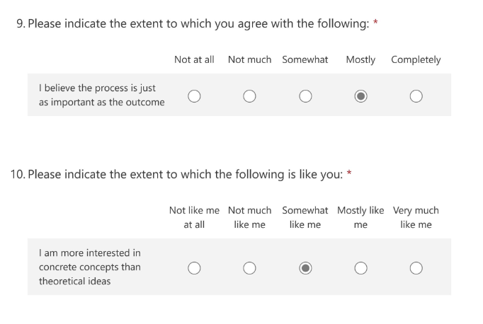

## Quant Trader - Junior

### Parameters
* Role: Quant Trader - Junior
* Location: Austinmer, New South Wales, Australia
* Applied: November 30, 2021
* Notified of failure: December 21, 2021

### HackerRank entrance exam

This appears to be non-automatic but something every applicant gets. Unlike others I've done, this one is more of a "take-home" style exam and indeed the timer is 48 hours rather than the hour or two that is standard. The questions are still mostly Leetcode-based however:

* Q1 is a LeetCode Medium that has both "pesky" (implementation-based) and algorithmic aspects. Can be somewhat tricky to get it right quickly, though the lack of time pressure helps. 
* Q2 is a LeetCode Medium (straightforward 2-D DP); interestingly I independently came up with the same question about a year and a half back. So this was essentially solving my own question!
* Q3 is an odd one. It is what HackerRank calls as an "approximate solution" question, where there is no one right answer like a standard LeetCode problem. Indeed, this one asks you to perform interpolation and extrapolation to estimate some data. The marking scheme of the question ensures that it is virtually impossible to get full marks - that being said one doesn't have to go too fancy either to get a reasonable mark (note that you aren't given an indication of the mark you got). 

It should be noted that they have a history of recycling the same test questions - I've applied since the 2019-20 season and every time they have given me the exact same questions! This caused an issue this year, where I tried to access it but was told that I had already attempted the test. I tried asking them on what I should do, but got no response in a reasonable amount of time (they gave me five days and I had my finals on their deadline), so simply "redid" it using a different email. Note that while I did not copy any code at all, I still had an understanding of the approaches and common pitfalls from the last attempt, and that did help. With that it took 80 minutes to complete the test fully. 

### IQ and "personality" exams

The next stage was from Talegent (not a company I recall doing tests from before), and was a combination of

* a triplet of English (reading comprehension and vocabulary in context), Mathematics (basic data inference) and logical reasoning. For the former two it's answering 5/6 questions in 4 minutes, and the last allows 3 minutes for each question. The test is paced fast enough that it is likely one can be pressed for time, though it's still reasonable. Not that different from similar tests from other companies.  
* a "personality" test. This was so boring, forcing me to answer ~100 questions asking me to give an indication of agreeness of various statements from "strongly disagree" to "strongly agree". This was similar to the Microsoft Forms (+ an additional personality quiz) they sent when I applied last year (see below for an example from last year): 

### Notification of failure

Was by email. From my experience they are not receptive to asking for feedback. The contents of the 2021-22 and the 2020-21 failure emails are almost identical.

### Takeaway

* My application this year was a regression compared to my 2020-21 attempt. That time, I did manage to get all the way to the phone interview (which by the way was HR with a couple of brain teasers which I did get) and hence I did less well this time. 
* The only possible stage I could have failed this time were the IQ + personality entrance exams, and historically it is not common for me to fail IQ-based entrance exams (though that would always remain a possibility). This leaves me with the personality exam, which is something I routinely fail (in fact I'm not sure how I didn't fail that last year). Again I cannot be certain without feedback, and this is one reason I find rejection letters that do not give any indication so frustrating. 
* My understanding is (as a non Australian/New Zealand citizen) is that the AU job market is mostly off limits for me. I thought this was because the [Australian 482 visa](https://immi.homeaffairs.gov.au/visas/getting-a-visa/visa-listing/temporary-skill-shortage-482) explicitly says that two years' work experience in the relevant field is required, and this was why Epoch Capital failed me at the Round 1 interview (BTW: they explained the issue pretty well). Now, Tibra explicitly says that they are happy to sponsor visas, quoting them: "Tibra are accepting international applications year round however we recommend applying as soon as possible." and "Tibra will sponsor your visa". Clearly, there is something missing here since to me, Epoch and Tibra are telling me contradictory statements. I could be missing something, but am not sure what that is. 
* This failure stung pretty hard given how the challenge of finding a role that really interests me (also the fact that any regression is worrying given the state I'm at). 