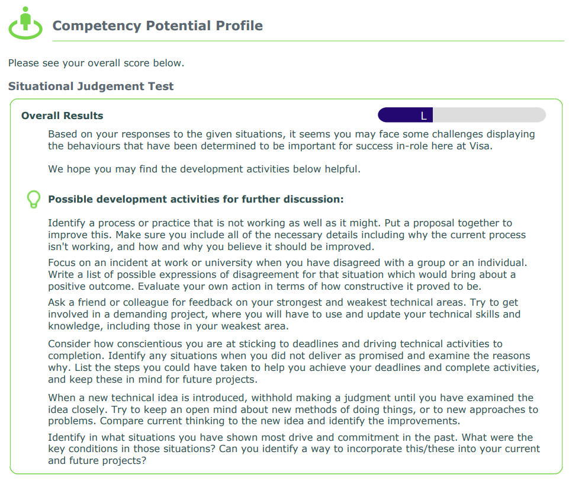

## Software Engineering and Testing Graduate

### Parameters

* Role: Software Engineering and Testing Graduate
* Location: Reading, United Kingdom
* Date of application: December 6, 2021
* Notification of failure: December 19, 2021

### HackerRank entrance exam

This appears to be something everyone gets. 2 questions, 60 minutes. 

The exam was harder than I expected. The first one was a LeetCode Medium, pesky but something I quickly finished. The second one was a harder LeetCode medium and was a tricky 2-D DP problem - I didn't expect that one to show up for a company like Visa (that would previously cheap out by using Arctic Shores). While I did get it fully right in the end, it did take up time, and I was left with only 6 minutes in the end. Note that the HackerRank title included "New Grad-Masters/PhD" - suspect undergraduates would be served easier questions? I also suspect that a full mark would not be required to progress to the next round given its relative difficulty. 

### Situational judgement exam

After that (not immediately though), I was asked to complete a SJT (situational judgement test). This was 15 questions, and while the question did have a SWE flavour in it (for instance, referencing terms such as scrum), it was otherwise not different from the others I've done. 

### Notification of failure

Right after doing the test, I was notified that I failed the test and would be kicked out immediately:

I also got a "feedback report" by email. The only meaningful page was this:

It should not be hard to guess the usefulness (almost none) - it was definitely not "helpful" and the "possible development activities" is junk without more context. 

**Update (January 3, 2022)**: given that this role is in the UK, I found out that I'm eligible under the GDPR (see [Article 22](https://gdpr-info.eu/art-22-gdpr/)) to have this automated rejection reviewed. So I did that, first asking SHL, who rightly told me to ask Visa (but then I couldn't find any email to contact, so asked SHL to forward it to them). I got this email (along with an automated rejection email) from the man whose picture is shown in the original rejection (note that someone was cc'ed whose rank could not be verified and hence their name will not be published):

<blockquote>

Hi Leader,

I hope you’re well and had a nice break over the festive period.

I am getting in touch as the team at SHL contacted me and let me know that you have requested human intervention in your application. I have taken the time to review your results from the Situational Judgement Test you completed and we will be staying with the original decision. Whilst you clearly have very strong technical skills, I don’t feel the type of role or working environment we have at Visa is a good fit based on your responses to the SJT questions.

The SJT is built using real scenarios our Graduates have found themselves in and how they responded (and how their managers want them to respond), so whilst the SJT suggests you aren’t a strong fit for Visa, companies looking for people to handle the same scenarios in different ways, or handling scenarios you wouldn’t experience at Visa, could be a great fit for you.

All the best for the future,  
Daniel

Daniel Farrar (He/Him)  
Next Gen Talent Lead - Europe  
Visa, People Team  
[mobile and email]  
Paddington, London

</blockquote>

This is also useless. I know that I've been rejected by means of a pesky test, and hence all are you seem to be doing is effectively parrot-repeating what the SHL automated rejection said. What I was looking is either a full reversal (given my highly lopsided results) or a proper explanation of why my answers were rejected automatically (what you said doesn't count). Looking at the GDPR article, it says is that the company is obliged to provide "at least the right to obtain human intervention on the part of the controller, to express his or her point of view and to contest the decision.". I'm not sure whether that means that I have the right to explain why I should not be rejected? I don't know. 
### Takeaway

* I'm used to failing SJT tests and its derivatives - in fact I rarely do _not_ fail them. That being said, I have a feeling this was also implicitly looking for some SWE experience - of which I have none. Maybe I'm wrong there, but the terminology contained more SWE-based terms than some others I've done. 
* I hate SJT tests with passion. 