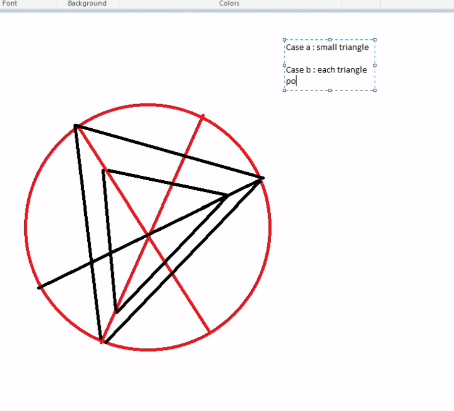
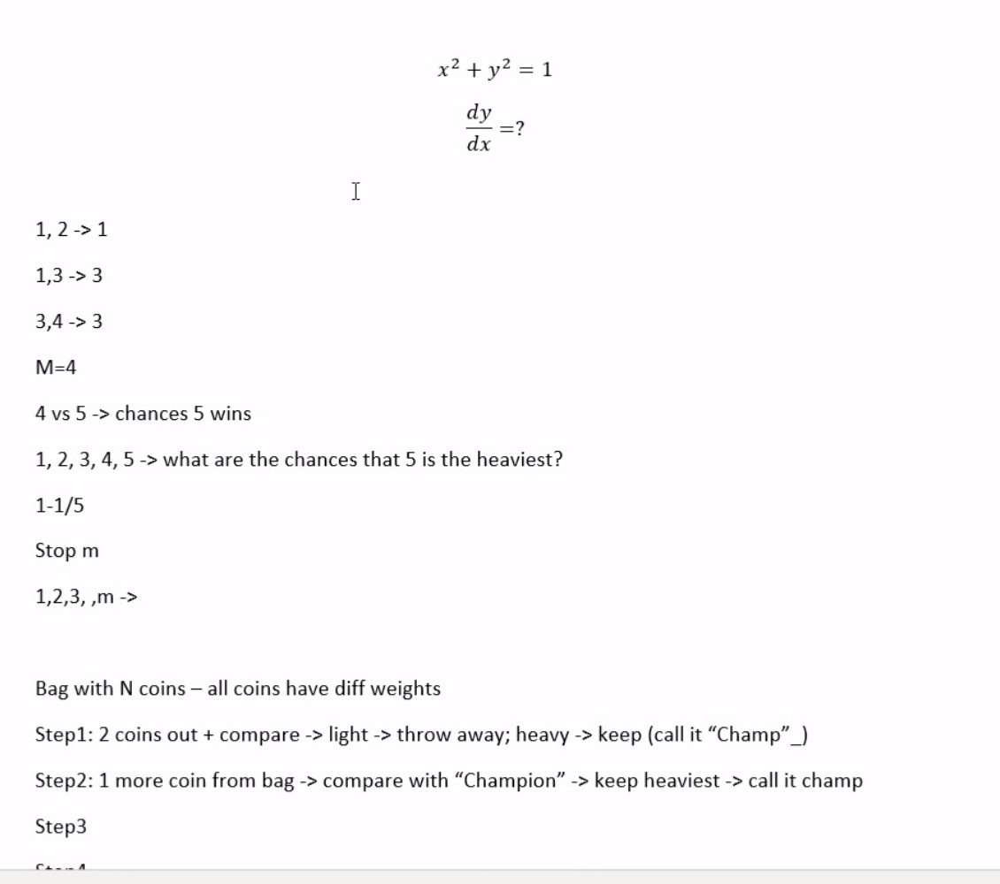

## 2024 Quant Graduate Programme

> Notes:
> * Keep in mind the distinction between Rokos (the company) and Dartmouth Partners (the recruiting agency recruiting on behalf of Rokos)
> * There are parts that are said in one section that would be directly contradicted in another. Read the full report. 

### Parameters

* Applied: August 28th, 2023
* First (HR, Dartmouth) phone interview: October 2nd, 2023
* Second (Rokos) phone interview: October 17th, 2023
* Finals: October 25th, 2023
* Notification of failure: October 25th, 2023
### Prelude

I first applied to this company in 2021, when I applied to what was called as just the "Analyst" graduate programme. I got this email from Dartmouth about three weeks after applying:

> Thanks for applying for the Rokos Analyst Programme. I wondered whether you’d be interested in applying for the Technology Programme however as your profile is possibly more suited to it? For further information, an info pack is attached. Let me know if you have any questions.

... but I indeed did intend to apply to the Analyst programme (note: that's not exactly identical to the quant graduate programme that would form the basis of this report). I did ask them to clarify while making it clear that I was OK to being considered for the technology graduate programme:

> Thanks very much. While I have no issues to being considered for the technology position, I was wondering on what kind of profile you were looking for the standard analyst position because I thought my quantitative background was suited for both (though I could have missed something). Thanks in advance.

I got no response, and ended up with a rejection letter, having gone nowhere in either graduate programme:

> We appreciate the time you’ve invested in the application process, although unfortunately we will not be taking your application further on this occasion.

---

Fast-forward to 2023. This time, I applied to the quant graduate programme, as it sounded like a very good fit for me. Unlike last time, Dartmouth didn't question me right at the start. 

### Elenchus entrance exam

The first test I had to take was the Elenchus entrance exam, which (oddly to me) was proctored by a Dartmouth Partners recruiter (and I had to book for a suitable slot as well). I had to show my face, but my mic remained off. Not clear why they do this, but anyway...

The entrance exam itself was mostly Maths and English - while straightforward, one had to watch out for common traps - and while the English section (testing grammar mostly) wasn't difficult for a non-native speaker like me, I still felt that it was discriminatory. There were also a few "family relationship" questions which I personally found very annoying (the questions were like "what's the relationship between someone's mother's grandmother's son's whatever"). 

10 minutes, 30 questions - so while very fast-paced, it's not like most questions take more than a few seconds anyway. It's important to skip and come back as necessary. 

### Codility entrance exam

After passing the Elenchus entrance exam, I had to take the Codility exam. This one was unproctored. I was surprised I had to take this test at first, given that nowhere in the job specification did they mention such a test (was confused whether I had been transferred to the technology graduate programme). Sent an email, and it was clarified that the entrance exam applied to both programmes. 

Three LeetCode mediums, on greedy, binary search and a tree-based question. Not difficult, though you did need to know the common optimisation algorithms common to LeetCode Medium problems. Finished the 90-minute exam in little over a third of the time (so had an hour to spare). 

### Maths entrance exam

The third phase was a proctored maths exam:

* I had to handwrite my answers - apparently they check the working! That was the first time I ever had to do something like this.
* 9 questions, 90 minutes. 
* Each question had anywhere from 2 to 6 marks, with a total of 40 marks available. 
* The exam itself was reasonable in difficulty, but you did have to know your concepts. In particular, it was themed around probability and statistics - with two questions directly testing knowledge of variance and correlation formulas, a couple of ones closer to a brainteaser, a couple of combinatorics-based questions, and one which just made no sense to me without using a graphing calculator (and they conveniently didn't mention whether notes and graphing calculators were allowed). 
* After the exam, I had to photograph my answers, convert to PDF and sent to Dartmouth. 

Given that it was hosted on Teams, I could see the identities of the other candidates taking the exam. They all came from the most elite universities in the UK (Cambridge, Oxford, Imperial etc, with one or two from similarly leading universities from other countries). A part of me wondered whether I could ever compete with these people, who naturally have both the technical and social chops needed to get jobs...

What surprised me the most was the speed with which they came back. 

### The first interview
Only about an hour after the exam, I got this:

<blockquote> 
Thank you for taking the time to interview with us for the Rokos Capital Management 2024 Graduate Programmes.

Following this conversation, we are delighted to invite you to the next stage of the application process which will be a video interview.

We have included a link below which will take you through to an online booking system where you can select a suitable interview time. If you are unable to find any suitable slots, or if all slots are currently booked, then please check back over the next 3 working days, as we open slots on a rolling basis and will ensure there is a time which works for you.
</blockquote>

That was fast! Makes one wonder what exactly they did - my hypothesis is that they simply compared the answers... Anyway: I went to the site and picked a date. I tried asking Dartmouth and what the interview would be about, but got no response. After booking, I got a (mis-sent?) automated email asking me to book for the Elenchus entrance exam...

<blockquote>
Thank you for your application to the Rokos Capital Management 2024 Graduate Programmes.
We are pleased to inform you that we would like to invite you to the next stage of the application process, which is is a short online test, invigilated by a team member at Dartmouth Partners.
</blockquote>

More concerning was that I didn't get any email or invite to the interview, even on the day of the interview. In fact, I didn't even know whether the interview time (2:30 pm) was UK time or at my timezone (I was two hours ahead of the UK at that time). After trying to call (all went to the voicemail) and email them, I got this:

<blockquote>
I sincerely apologise for the late notice, however the team will be unable to facilitate your Rokos interview at 14.30 today. I will send a new link now to book in for a time at a later date; I hope this doesn’t cause too much inconvenience and apologies again!
</blockquote>

That was at 2:10 pm UK time. My parents were so worried that I had screwed something up, and all of us agreed that Dartmouth could have handled this better (least of all, giving more than 20 minutes' notice). 

It doesn't end there. They did not send the link they promised, leading me to send a reminder. When they finally did, the booking link was pointing me to the old interview slot and did not give me a chance to rebook. Finally, they had to suggest a set of interview timeslots and book it manually for me. Similarly, I had to push to get this description about the interview itself:

> It will be a 15 minute interview to run through your background, knowledge of RCM and motivations for working with the firm.

Now, about the interview itself. In the end, the interview was indeed HR-based (took about 20 minutes) and from Dartmouth, but the interviewer was not afraid to delve deeper where needed. They asked things such as

* my hobbies
* a summary of my CV
* my work experience
* why this company (including why buy vs sell)
* how I keep my finance knowledge up-to-date (and to give an example)

Personally, I found parts of the interview challenging, especially the part on "why a **macro-hedge** fund", but otherwise reasonable. 

They also said that

* About 25 people (but flexible) will get to the assessment centre
* The assessment centre is on Oct 25th, in-person, and they expect only one
* You'll know if you passed or not on Oct 13th
* All people invited to the interview have passed the three testing stages.
* About 3 - 4 (but flexible) people will ultimately get the offer
* I would get to know in a week's time or so
* the salary is estimated to be in the £80,000 - £90,000 range (quite high to me!)

### The second interview

After the first interview, my impression was that there was only one more stage, that is, the assessment centre. Turns out that wasn't the case. On October 10th, I got this:

<blockquote>

Hi, 

Thank you for your time recently to interview for RCM. 

Just to make sure I’ve got accurate data, that is consistent across the candidate pool, please can you respond to this email with your grades for –
-	High school (A Levels or equivalent) 
-	Undergraduate Degree 
-	Post Graduate degree(s) (Either final or projected). 

Thanks,
(recruiter from Dartmouth)
</blockquote>

Sounded like good news (though some reported getting this email but not getting the invitation to the next stage, at least not that week), but on decision day, I got this:

<blockquote>

As mentioned, we met with the Rokos team earlier today and I’m pleased to say that the team were impressed with your profile and performance throughout assessment, and would like to invite you to the next stage of the process.

This will be a 30-minute video interview with a member of the RCM HR team to go through your background, motivations and general knowledge of the finance industry and more specifically macro-hedge fund space. They will want to see you have researched RCM and can elaborate on why the Quant programme in particular appeals to you. I have attached the marketing brochure here for reference to remind you of the programme, however I would recommend doing some of your own research on the firm as well. This is also a chance to ask any questions you might have on the programme or RCM generally.

As a reminder, the firm is looking for candidates who are passionate about the industry, can demonstrate strong analysis and data-driven skills as well as communication and collaboration, so make sure these competencies come through during your interview!

In terms of timeline, we would ideally like to get these completed before the beginning of next week. Please let me know your full availability for Monday 16th and Tuesday 17th and we will confirm your interview slot asap.

If you are successful, the next stage after this would be an assessment centre involving a number of interviews and possibly a technical exercise. As always, let me know if you have any questions!
</blockquote>

So I now have a **second** HR interview? What was the purpose of the first one then? I was puzzled, so I had to explicitly confirm:

> I had a similar interview with a member of the Dartmouth Partners team – is this meant to be different? Just want to clarify since I was told then that the next step would be the assessment centre.

And indeed:

> Yes, as mentioned, this is an interview with the RCM team. It should have been communicated to you that this would be the stage after DP interview and the AD will come next.

So the Dartmouth interviewer was wrong (and the discrepancies don't end there!)... Anyway, I scheduled a suitable time and indeed got the Teams invite from them. 

The second interview itself was of a similar format to the first, with the main difference being that the interviewer was a HR Analyst from Rokos. The questions were mostly stock (why Rokos, tell me about your CV, why this degree and university, why this programme etc), with the trickiest question being "tell me your favourite book" (didn't prepare for that; fortunately I had an answer as a book from that publisher was in my desk so I simply showed it in the camera). 

I was told

* there would be about 10 people in each assessment centre, and there can be more than one assessment centre
* there would be only one person hired in the end (maybe two if there is a strong candidate) - this was indeed the case in 2023
* I would get to know whether I made it to the last round by the end of this week

And then to wait. Makes one wonder on the purpose of making this much effort only to hire one candidate in the end, as my mother wondered...

### Getting to the finals

A day before their announced "decision day", I got this:

> Congratulations. We are thrilled to be inviting you to an Assessment Centre for RCM's 2024 Quant Graduate Programme - this is being held next Wednesday 25th October at our offices at 23 Savile Row, Mayfair, London, W1S 2ET. Our strong preference is for you to attend in-person, but please advise us if you would only be able to attend remotely.

That itself was a surprise. But there's more. They subsequently sent over a PDF ([this one](..%2F..%2F..%2Fmedia%2Frokos1.pdf)) with details of the assessment cenre. Most surprising was this:

> We would be delighted to invite you to a private drinks and nibbles
event the evening before the Assessment Centre on Tuesday 24th
October 2023. You will have the chance to meet with different
members of our Quant and Trading Strategy teams in an informal
setting ahead of visiting us on-site the following day. This will be
held in the private room upstairs at Masons Arms, 38 Maddox
Street, London W1S 1PY from 18:45 - 20:15.

Wait, a *drinks* event before the finals? That in itself was hard to believe for me - are they trying to comfort the candidates before chopping them off the next day or what? Is this normal with other companies of similar calibre?

But here was the problem: I don't live in the UK, and furthermore require a visa to even visit it. And Rokos gave only 6 days' notice for the finals, which means that even if I were to submit the documents on Sunday (here in Bahrain, Friday and Saturday are public holidays) and use the [super priority visa service](https://www.gov.uk/faster-decision-visa-settlement#:~:text=Using%20the%20super%20priority%20service,appointment%20is%20on%20a%20weekday) - which in itself costs 1000 pounds - I would at best just be able to make it. That is if they even are going to sponsor the cost of international travel - the PDF clearly assumed that everyone lived in the UK. So I sent a email, and followed up with a reminder the next day when I got no response. And in the end I got this:

> Thanks for getting in touch and apologies no one got back to you yesterday – we had an Assessment Centre for another of our Graduate Programmes so was away from desk.  We did not realise you were based in Kuwait currently – apologies if you flagged this to someone. We will gladly accommodate a remote Assessment Centre for you. More details to follow on exact timings, Microsoft Teams links etc. at the start of next week.

They got the country wrong, but otherwise their response makes sense. My parents were keen for me to come in-person, but I had to tell them that it was not feasible. 

And indeed, 

* two days before the finals, I got a [brief PDF about the remote assessment centre](..%2F..%2F..%2Fmedia%2Frokos2.pdf)
* one day before the finals, I got the link to the Teams session and the interviewers' names

### The finals

#### Part 1 (Investment Quant)

The first part consisted of the interviewer basically telling me to run over my CV and asked a couple of questions on what I did when I had a full-time job. Then came the technical problems.

* The first problem was to compute the derivative of x<sup>2</sup> + y<sup>2</sup> = 1. This itself was a little unexpected, but I easily got the answer.
* The second problem was where things started to get wrong. Given a circle with three legs on it. A table is placed over the three legs. What is the probability the table does not fall down? I was **very** confused at this one, as the wording of the problem suggested that I needed to consider the centre of gravity? Worse, I continued to struggle when presented with the hints: 

... and I didn't get anywhere, to the extent that the interviewer gave up and moved on!

* The third problem was easier, but we were starting to run out of time and it's not like I did better, with the question requiring several clarifications from me. 

You're given _n_ coins with different weights. In the first round, two coins are taken out, compared, and the lighter one is thrown away. Call the heavy one "Champ". Then, for the next _m_ - 1 rounds, one coin is taken from the bag and compared with the current heaviest coin (which is called as "Champion" above), with the heaviest coin being kept. What is the probability that in the *m*th round, the heaviest coin does not change (i.e, the (_m_ + 1)th coin is lighter)? I missed the fact that *n* has nothing to do with the answer.

And that was it. I thought that was the worst interview I've had in a long time, to the extent that I thought I'd be kicked out right after (without moving to the second of the three technical rounds). But that did not happen. 

#### Part 2 (Trading Strategy)

The first part consisted of a straightforward LeetCode Medium problem: 

Given a string, find the number of consecutive character regions. For example, the number of consecutive character regions in "abbccca" is 4, with "a", "bb", "cccc" and "a" being the character regions. This was easy; the only problem was that I initially interpreted the problem in a way that one-length regions would not count. 

The next part was of applied finance. I was first given some basic information on mortgages. Then, the question:

Suppose you have $100 mortgaged with an interest of five years. You pay $7 every year. Sketch a graph of the remaining balance with time. 

Didn't find that hard. Then, the third part, which I found trickier:

* Consider Microsoft stock at $100. Quote a bid and ask price. 
* Suppose someone buys 5 stocks from you. The next day, the person comes back to you. Quote another bid and ask price.
* Quote another bid and ask price

The problem was that I unfortunately seemed to have a different intuition from what the correct answer was. For instance, consider the first part. I quoted $99 and $101 respectively. Now after the person brought 5 stocks for me, I said $99.5 and $100.5 instead (i.e, narrowing the spread). When questioned why, I reasoned that the person coming back the next day (after buying) could imply that they might have found another buyer, and hence the spread needs to be narrowed as otherwise they would buy it from someone else. According to the interviewer (and my father said the same later on), this reasoning is not correct. The reason is that the person buying 5 stocks signifies _demand_ - which means that you can afford to _increase_ the spread - not reduce it. However, when I was asked to give the bid and ask price again, (using the reasoning given by the interviewer), I increased the spread. To that I was told on the lines of "watch out - if the spread is too high they'd just buy it from someone else" - which is the exact reasoning I used earlier, so... According to my father, the "mistakes" I made was a direct result of my having insufficient finance knowledge and experience. The interviewer also mentioned that the bid and ask prices should be based on the expectations of _all_ possible beliefs - but then I clearly mentioned that I was considering a _specific_ case. 

After that, a brainteaser - the classic 25 horses' problem. The problem started with finding the minimum number of races required to determine the winner, and then I was asked to talk through how I'd find the top three races. The interviewer was kind of in a hurry though by that point. 

That was the end of this stage. Not perfect, but better than the horrific part 1. 

#### Part 3 (Core Strategy)

And this is the part that surprised me most, as it resembled an interview for a SWE position (and it was not mentioned anywhere that I'd be given any coding problems in the first place). So, how were they?

The first part was to complete the below function, where `yyyymmdd` is a date in ISO format, and `ma` is the number of months to add. If the resulting date is invalid, return the latest valid date in that month. 
```java
int addMonths(int yyyymmdd, int ma) {
}
```

My first instinct was to extract the years, month and date using substrings, but he shut down that idea quickly. So I manually divided and extracted the date. The next challenge was to handle the "invalid date" edge case, which took a couple of minutes for me to even realise when pointed out. In the end, this is what my code roughly looked like:

```java

int i = 20231001 // 1 Oct 2023
addMonths(i, 3) -> 20240101
        
input = 20231001
ma = -12
output = 20221001

bool isLeapYear(int y)
{
}


HashMap<Integer, Integer> daysinmonth;

int daysInMonth(int m, int y) {
  ...
}


int addMonths(int yyyymmdd, int ma) {

int year = yyyymmdd/10^4; // 2023
yyyymmdd-=year*10000; // (mm, dd) // 1001
int month = yyyymmdd/10^2; // 10
yyyymmdd-=month*100; // 1001 - 1000 = 1
int day = yyyymmdd; // 1

month+=ma; // month = 13

//month = -2

if (month % 12 == 0)
{
  year = year + (month/12 - 1);
  month = 12; // the only case
}
else
{
  // -2 % 12 = 10 // python
  // -2 / 12 = -1

  // -2 % 12 = -2 // java?
  // -2 / 12 = 0

  // -2 = -12 * 1 + 10
  // -2 = 12 * -1 + 10

  year = year + month/12; // 2024
  month %= 12; // = 1
}

if (day > daysInMonth(month, year))
day = daysInMonth;


int new_date = day + 100*month + 10000*year; // 1 + 100 + 20240000 = 20240101 -> 

return new_date;
```

The second part was on trees. It was kind of interactive: given the following tree representation:

```
       A
   B       C
  D E     F G
```

and the following data structure

```c
Node {
    Node l;
    Node r;
    string val;
}
```

complete 

```c
void Dump(Node n)
{
}
```

that would print the tree representation of this function. 

Initially, the question was flexible and asked me to print the tree in any format. So I did this:

```java
void Dump(Node n)
{
if (n == null)
return; 

Dump(n.left);
print(n.val + '\n');
Dump(n.right);
}
```

That's a standard DFS traversal, resulting in the below output (1):

```
A
B
D
E
C
F
G
```

Then he asked me to go iterative, asking me to traverse the tree using BFS:

```java
void Dump(Node n)
{
Queue<Node> Q = new Stack() // new Queue<>();
Q.add(n);

// in each iteration, give me the children

while (Q.size() != 0)
{
  // remove the node
  Node N = Q.delete();
  print(N.val);
  if (N.right != null)
  Q.add(N.right);
  if (N.left != null)
  Q.add(N.left);

}
}
```

That, being a level-order traversal, is *not* going to give the DFS output. So he asked me to iteratively come up with a DFS traversal! That becomes substantially trickier, because you now need to use a stack. That was what the rest of the interview was above, with my incrementally building up a stack-based approach, with roughly the below pseudocode in the end:

```java
void Dump(Node N)
{
  stack.add(N); // add the root

  while(stack.size() != 0)
  {
    // recursive

    N = stack.remove();
    if (N.left != null)
    {
    stack.add(N.left);
    N = N.left;
    }
    // pull out the last value

   

   print(N.val)

   if (N.right != null)
    {
    stack.add(N.right);
    N = N.right;
    }

  }

  // A B D
}

```

At that point, we already took over an hour (15 minutes more than estimated), and that was the end of the interview. My feeling was that he was testing my fundamentals hard - it's a LeetCode Easy to perform a simple DFS traversal - but to do this iteratively would not be that easy of a LeetCode Medium in my opinion (since in most LeetCode problems, *how* you get a passing solution doesn't matter). 

### Notification of failure

The finals were set up as a two-stage process - the last two non-technical interviews would happen only if you got through the first three technical interviews. And predictably, that did not happen:

<blockquote>
Hi Leader

Thank you so much for your effort and attention on this morning’s interviews.

Unfortunately we have decided against progressing your application to the afternoon interviews – I appreciate this is disappointing news but the calibre of candidates was exceptionally high and the team have had to make some incredibly difficult decisions.

Whilst you were strong technically and impressed in your Core Quant interview with [core quant interviewer], there were question marks over your approach and communication style. Some interviewers felt you jumped into answers before thinking which led to sub-optimal solutions across both the Core Quant and Trading Strategy interviews.

Thank you for your time and interest in RCM and we wish you the absolute best of luck in the future.


</blockquote>

The feedback, albeit brief, was interesting:

* it made no mention of my horrific Investment Quant interview. This could mean
  * the questions were too hard for all, or the interviewer realised that it wasn't a good question (?) - I find this unlikely
  * they marked principally on approach and communication, and not on getting the correct answer per se
  * I did poorly enough overall that they didn't see the need to rub more salt into the wound (i.e, make things even more negative)
* I failed yet again on communication. Communication skills doesn't come naturally to me unlike the average person; just like maths or CS, it's something I need to consistently practice and work on to have any chance of passing. This means that I normally just stick to a template and try to follow it as well as possible. My feeling is that when they say "jumped into answers before thinking", I was simply giving my thought process and using the "start from inefficient and move upwards" approach common in SWE interviews (or so I thought). Given that I legitimately thought I had improved my communication skills since the last year (and I managed to pass two HR interviews, which is quite rare), it was disappointing to get the "yet again" feeling. 
* As a result, I personally thought that it would have been helpful if RCM gave a guide on how to answer questions, so that I can adapt my approach accordingly. Or this is something that I just somehow need to figure out on my own...

> In-person candidates will get their feedback on-the-spot, and if you do get to the final set of two interviews, you won't know whether you made it on that day. Also a Reddit user reported that (in the pre-drinks event) the RCM team told that they were planning to hire as many as they could this year (yet another contradiction!). 

### Takeaway

* Overall: while I felt that the process was competent, I got the feeling that there were enough rough edges that Dartmouth didn't deserve the "multi award-winning" recruitment consultancy they claim on their (fancy) website. That despite there being no major errors - it was the combination of issues that would be minor taken individually that I didn't like. I don't think RCM is off the hook either - the amount of contradictions I got on the number of people they were hiring was rather irritating to see. Similarly, if 40% of the finals would be coding, I think that needs to be mentioned in the PDF. 
* I could find very little information about the process itself, so [asked](https://www.reddit.com/r/FinancialCareers/comments/16m2xqs/rokos_capital_management_quant_maths_test/) [Reddit](https://www.reddit.com/r/FinancialCareers/comments/16qboqc/rokos_capital_management_2024_video_interview/). Turns out that no one knew either, as I got several inquiries from other candidates! Hopefully this report will help candidates applying for future years. Similarly, I should thank my fellow candidates on Reddit for giving me useful information (especially on the finals) that I've incorporated in this article.
* So near, yet so far. I live with my parents, and if there is someone that was more disappointed than I was, it was them. 