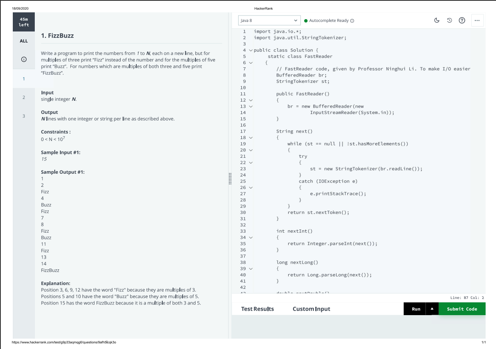
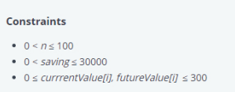
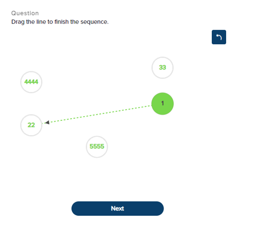
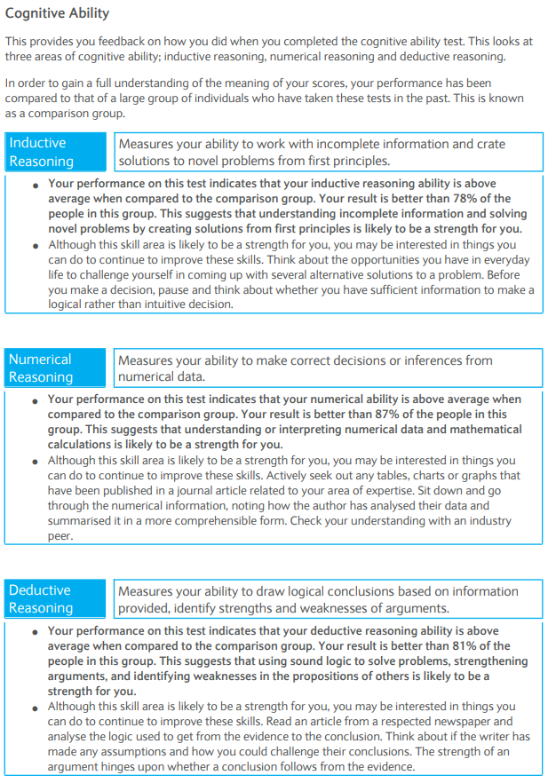
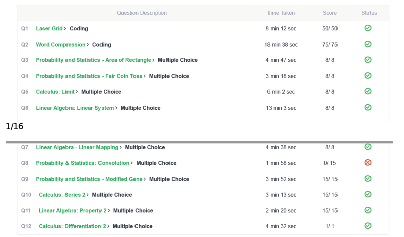
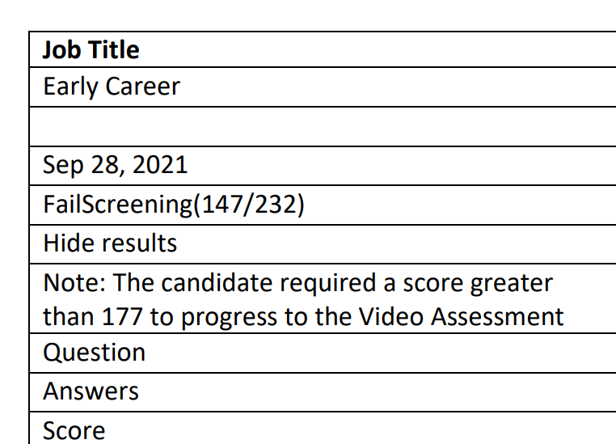

# Online Assessment/Coding Tests

**Figure 1**: An example of an OA question - this used to be asked by Capital One from at least the 2018-2019 season up until the 2021-22 season, when they switched to the CodeSignal GCA (covered later on here)

This is generally done at the very first stage, before an interview, and
is often automated (so your resume may have not even been read yet!).
There is generally a cut-off score; you should aim to get everything
right, but in some cases, it is possible to progress without getting the
entire test right, especially if the test is harder than usual. Note
that doing well on the OA does not mean that you will progress to the
interview as a result (Databricks and JP Morgan being examples).

**Figure 2**: Constraints provided for a HackerRank problem. You’re going to
see this in nearly every OA question and is a <b>huge</b> clue for you. For example, for the above constraints, O(_n_2) would be ~104, which looks like a good choice for this question (and indeed it was, being a 2D DP problem). An O(_n_3) algorithm would be a stretch (but could pass, and is better than nothing!) and O(2_n_) will result in a TLE (time limit exceeded). This doesn't look like a question that requires O(_n_ log _n_) or O(_n_) though.  

Use the information in a question to your advantage! It will often
implicitly tell you how efficient your algorithm should be to get full
points. Consider the fact that a computer can run 108
iterations per second. You’re usually going to be given an array or
string; call its size _n_. Note that you **cannot** be asked to come
up with a solution better than O(_n_) in this case (even if one
exists); the reason is that it takes linear time to input the test array
itself! With that in mind,

  - If \(_n_ > 104\), aim for a O(_n_) or a
    O(_n_ log _n_) solution. Keep in mind that it's very unusual for a solution not to work in O(n log n) but work in O(n).

  - If \(_n_ > 103\), aim for a O(_n_2) solution

  - If \(_n_ > 102\), aim for a O(_n_3) solution

  - If \(_n_ < 20\), a O(2_n_) solution should be fine.

A good idea is to start from an inefficient solution and work your way
upwards, improving the complexity along the way (there's a saying out there that goes along the lines of "pick the weakest/slowest solution that works"). You could find out (for
HackerRank) that a supposedly inefficient solution actually works well!
Also note that while an inefficient but working solution will get you
some points, an efficient but broken solution is useless as no marks are
given for “effort” (in general). Plus you can often “game” the system a bit in such
cases to collect a few more points by leveraging the properties of edge
cases, for instance. Similarly, don't bother about "beautifying" or making code clean unless otherwise asked to - most of the time, your code will not even be read at all! Working and efficient but dirty code is almost always better than clean code that doesn't work. 

A common question is whether you can look up on the internet when
completing these tests. The answer is generally yes, unless you’ve been
told not to. This is for syntactical searches, not the entire question (so
asking on how to retrieve from a Java TreeMap is fine) – plagiarism
checkers are there which will detect copied solutions to the problem.

The best way to practice for an online assessment is usually LeetCode.
Indeed, some companies (like JP Morgan) often recycle questions from it,
and it’s otherwise a good place to practice and keep the algorithmic
skills fresh. Doing the [daily
challenges](https://leetcode.com/discuss/general-discussion/655704/november-leetcoding-challenge-new-feature-and-rewards)
is a good way.

## Providers

There are some major providers that run these tests, some of which are
given below:

### HackerRank

These tests are designed by the company using (generally) HackerRank’s
own questions or that of the company. Usually, you are given a number of
questions to solve in a fixed time frame (anywhere from 30 minutes to 2
hours [^1]). You’re generally, but not always, given freedom on the
language you choose to code.  
  
Once you code, there are two kinds of test cases that your code will be
run though:

  - Visible test cases: they are the test cases that you can see what
    the input, and the expected output, was.

  - Hidden test cases: they are the test cases that you’re not given
    what the input or the expected output is and are used to prevent
    people from hard coding the results. Since 2020, you can get some
    information on the test cases by using print/debug statements; use
    them to your advantage.

You can also run your own test cases, and in some cases, you’ll be able
to find out what the expected result should be for that custom test
case.

It used to be the case that HackerRank was known for making you have to do the I/O (input/output) yourself, but this is rare now.  

### Codility

Mostly similar to HackerRank, with a major difference. You are not given
any information on the hidden test cases, which means that you will not
have a definite idea on whether your code was truly correct (and are not
given a score either), even after completing the test (with the rare
exception, like AMEX). Also, unlike HackerRank, once you “submit” a
solution during a test, you cannot make any changes to it.

It is hence important to validate correctness of a solution by running it with custom test cases and watching out for corner cases - it is easy to make simple errors that can badly affect the score. 

### CodeSignal

<blockquote>
<b>Changes for spring 2023</b>

Historically, the CodeSignal GCA worked on a 300-850 score scale. Since spring 2023, CodeSignal has transitioned into a newer 200-600 scale that is meant to allow for a common scale with CodeSignal's other tests. See [this](https://github.com/Leader-board/OA-and-Interviews/tree/ce5d21cc90a5c29db768197da8ee2513bbf6f580) if you're looking for the old scale details. Key notes:

* the test content has not changed at all. 
* unlike before, partially correct questions (i.e, from a TLE in Q4 that's common with brute-force solutions) are marked with relative generosity. It used to be the case that you would get almost nothing from a question that you didn't answer perfectly; this is no longer the case. 
* while CodeSignal provides a conversion table from the 300-850 scale to the 200-600 scale, our observation is that it's too simplified. In other words, you cannot use this as a like-for-like conversion between old and new scales, since the parameters used between the two scales have changed (in particular, due to the partial marking changes). See [this](https://www.reddit.com/r/csMajors/comments/1444fg3/codesignal_2023_scores_seems_to_be_glitched/) for more examples. The consequence of this is that a (say) 779 in the old scale could be a 550 or a 520 (and vice-versa), meaning that you'll have to check your new score to see if it's where you want it to be. 

Relevant CodeSignal articles:

* [Understanding Coding Score 2023](https://support.codesignal.com/hc/en-us/articles/13261190299287-Understanding-Coding-Score-2023) - provides a high-level overview of the changes
* [Converting Historical Coding Score Thresholds to Coding Score 2023
  ](https://support.codesignal.com/hc/en-us/articles/13260678794775) - provides a crude conversion table for converting from current scoring scales from all of CodeSignal's tests to the new 200-600 system.

</blockquote>

Normally used by companies for their GCA (General Coding Assessment)
test, which is a standardised coding examination (think of it as the
SAT/ACT of coding for those in the US). As a result,

  - It is possible to submit a test result to multiple companies. This
    goes both ways – if you do well once, you won’t have to retake the
    test for a good period of time as you can simply share the result
    for other companies. Similarly, if you do poorly and several
    companies request that score (and you do not have a better one to
    share), you can run into trouble.

  - This is usually the most proctored test you will need to take. Most
    companies will request the proctored variant of the GCA, which means
    that you will be forced to share your screen, present a form of
    identification before the test and have them record you (though they
    say that companies will not be provided proctoring data and is only
    used to confirm that you didn't cheat). A minority will be fine with
    the unproctored variant, but it is recommended to opt in to
    proctoring since an unproctored test result cannot be sent to
    companies that require proctoring.
  
The nature of the GCA means that there is significantly more uniformity
in the questions you’ll get compared to the other test types. For the
70-minute test, you’ll get 4 questions.

  - Q1 and Q2 are gimmes and should be crushed as soon as possible.

  - Q3 is usually an implementation-heavy LeetCode Medium problem and
    from experience is usually a 2-D matrix problem that is very *bashing*-friendly. What this means is
    there isn’t much in the way of algorithmic complexities to bother
    with – the solution is long, but you simply need to do what it asks
    you to do without worrying about time complexity and such.
    

    
LeetCode questions that approximate a CodeSignal Q3

    
    * https://leetcode.com/problems/spiral-matrix/
    * https://leetcode.com/problems/spiral-matrix-ii/
    * https://leetcode.com/problems/rotate-image/
    * https://leetcode.com/problems/diagonal-traverse/
    * https://leetcode.com/problems/reshape-the-matrix/
    * https://leetcode.com/problems/toeplitz-matrix/
    * https://leetcode.com/problems/image-overlap/
    * https://leetcode.com/problems/largest-local-values-in-a-matrix/
    * https://leetcode.com/problems/transpose-matrix/
    * https://leetcode.com/problems/text-justification - this is on the harder side but is a good example of a string-based implementation problem for Q3
    
    Aim to get them in 15-20 minutes or so. 
    

  - Q4 is a purely algorithmic LeetCode Medium problem – here you will
    need to focus on making sure that the time complexity is optimal. From
    experience Q4 normally involves a clever application of hashmaps and
    it is expected that you know how to work with it properly inside and out. While
    greedy problems are technically possible, DP (dynamic programming)
    questions will *not* show up in Q4 (and this test). 

    

    
LeetCode questions that approximate a CodeSignal Q4

      * https://leetcode.com/problems/longest-consecutive-sequence/
      * https://leetcode.com/problems/4sum-ii/ (note: it's unlikely that a CodeSignal Q4 will ask for an O(_n_3) solution as optimal, but this is still good practice)
      * https://leetcode.com/problems/pairs-of-songs-with-total-durations-divisible-by-60/
      * https://leetcode.com/problems/longest-palindrome-by-concatenating-two-letter-words/
      * https://leetcode.com/problems/array-of-doubled-pairs/
      * https://leetcode.com/problems/3sum-with-multiplicity/
      * https://leetcode.com/problems/count-number-of-nice-subarrays/
      * https://leetcode.com/problems/k-diff-pairs-in-an-array/
      * https://leetcode.com/problems/diagonal-traverse-ii/
      * https://leetcode.com/problems/find-occurrences-of-an-element-in-an-array/description/
      * https://leetcode.com/problems/find-the-number-of-distinct-colors-among-the-balls/description/
  
    Aim to get them in 20-30 minutes or so.
    

It is a very good idea to read CodeSignal's [coding assessment framework](./media/general-coding-assessment-framework.pdf). That document tells what would (and not) be tested on the GCA, and clearly tells that DP isn't on the test for instance. You can also get a couple of extra practice questions by going [here](./media/General-Coding-Skills-Evaluation-Framework-CodeSignal-Skills-Evaluation-Lab-Short.pdf).

Now what about scores? The scoring range is 200 to 600, and the more you get, the better. Completing all four questions of the test perfectly will get you a 600.

#### Retaking tests

CodeSignal historically had a generous retaking policy - one could resit the exam every two weeks. This means that the "damage" in case of a bad score was considerably limited, as you could normally just resit. 

This has changed since 2023: only two tests can be taken in a rolling 30-day period, and only three tests can be taken in a rolling 6-month period. This means that there is a much higher chance that you'll have no retakes, and means that you'll have to be more careful. See [this page](https://support.codesignal.com/hc/en-us/articles/11635510785047-What-is-a-cooldown-period-and-how-does-it-impact-my-ability-to-take-an-assessment-) for more information.

The only exception to this rule are cases where you won't have a valid result, such as if a company asks for a test that has been taken in (say) the last two months and you don't have such a result. 

#### How long are my results valid for?

Your test results are technically valid without an expiration date. However, companies have the right to set a limit on how old a test result must be, as described at [here](https://support.codesignal.com/hc/en-us/articles/1500001964122--Setting-age-limits-for-certification-results). What this means is that if you have a company that wants, for instance, only results in the last 6 months, but your latest result was earlier than that, you will not have a choice but to retake the exam, and a similar issue can happen if you had an older result that was better than a "valid" test result. Of course, those results will still be valid for those companies that don't use this feature, and you retain the right to retake the test even if you do have a valid result that meets this age limit. 

**Figure 3**: A CodeSignal test report (which is similar to what companies will
see)

Notice above that you’ll get a square graph that show
your implementation, problem-solving and speed – do not worry about them
too much. The scaled score out of 600 is the most important. Also, complete as much of the test as you can. It is better to write a brute-force solution for Q4 and get half points than to leave it blank - since spring 2023, CodeSignal has been more generous in marking partial solutions (they used to be very stingy with non-perfect solutions in the past).  

It may help to try out some CodeSignal GCA practice tests (which you can
take every day or so). The questions give a good approximation on what you would get on the actual
test.

In rare cases (such as SIG), you may be given a non-GCA examination (wherein the
questions are written by the company, much like HackerRank, and there is
no scaled score), in which case most of what was written for the HackerRank section would
apply instead. It's easy to find out if an exam is GCA - this will be clearly mentioned. 

Note that this guide does not cover tests such as CodeSignal's Data Science and Industry Coding frameworks (though there is a [nice guide](https://github.com/PaulLockett/CodeSignal_Practice_Industry_Coding_Framework) for the latter). 

### HireVue

**Figure 4:** A Hirevue score report from JP Morgan, which is not provided to candidates (unless you request it through GDPR or similar). Notice in particular that the rating of 3 was given to the one-way video portion, and that it appears to have been reviewed by a human. Oddly though, despite getting a "yes" recommendation, this application was kicked out after the Hirevue stage.

While relatively less common as a coding assessment platform, companies
like BlackRock and (in the past) JP Morgan use them, so it’s still around. The main
difference is that the interface is a bit clunky – while in other
platforms you shouldn’t have to mess with the I/O (input/output), this
isn’t the case for Hirevue. Plus you cannot even enter your own custom
test cases, and there is little information on how they actually grade
your solution.

[//]: # (**Note for JP Morgan**: you'll be told that there would be some coding questions, some video and some "behavioural" questions. The "behavioural" ones are just survey-like questions and not something to be bothered with. Now, for the coding questions. You'll be given &#40;usually&#41; a LeetCode easy and a LeetCode Medium. Immediately after completing each question, you'll be asked to respond on video, how you solved the problem and what you'd do given more time &#40;basically explaining your thought process&#41;. This is the "video" portion of the test - there aren't any "traditional" video questions to answer. )

It should be noted that the above covers only algorithmic-style
questions; in rare cases you may be given a more specialised form of the
test (such as a front-end variant). Those kinds of tests are out of
scope for this guide.

## Non-coding tests

This section covers some common non-coding tests that you may be asked
to take.

### SHL G+ (General Ability Test)

This is an IQ-based exam comprising logical, deduction and mathematical questions, asked for by companies such as Optiver, Barclays and Experian. There are two variants of this test, denoted as Variant 1 and 2 respectively.

* Variant 1 comprises 30 questions to be completed in 36 minutes, and every question is MCQ. Techniques that apply to any MCQ exam also apply here, such as elimination. 
* Variant 2 comprises 24 questions to be completed in 36 minutes, and each question is interactive. This is the test you're more likely to get now. 

Now, about Variant 2. There are many types of questions you can be asked - see [this page](https://www.lancaster.ac.uk/health-and-medicine/dhr/dclinpsy/applicants/shortlisting/) for some examples. In particular, make sure you do the practice questions - they have a rather annoying way of asking the question and can be confusing at times. In particular, the "drag the line" question needs prior practice, as the interface doesn't work the way you may expect it to (and can catch you off guard if you are given such a question in the actual test). 

 

**Figure 5**: A SHL G+ "dragging the line" question. 

Other relevant information:

* For Variant 2, the only mathematics questions in the test are data inference problems - where you'll have to interpret data to solve a problem (for example, find the profit of four industries and arrange in a pie chart). The questions are usually no harder than GCSE/grade 10-level in terms of the concepts required, but you do have to be quick given the time limit. For Variant 1, on top of Variant 2-style problems, you may be asked things such as work-rate problems.
* For the calendar problems (Variant 2 only), a useful tip is to take a picture of a calendar on the screen and quickly work through the cases using a tablet pen. This can help in whittling down the dates that definitely _cannot_ work so that you have less to consider in the end. This is most useful if you have a convertible (such as Surface) connected to another screen.
* Pacing the time is important - it's easy to spend too long on a problem and struggle to complete the test as a result. 
* If you have a disability making you eligible for extra time, tell the company. If you already get extra time at university, for example, you should be able to get extra time in this test as well. 
* In most cases, you won't get an indication of your performance in the test. However, what companies do have is your percentile in the deductive, logical and mathematics subsection of the test. A sample is shown below:    **Figure 6**: A SHL G+ Variant 2 test report.
* The percentile required to pass varies by company - apparently Optiver requires ridiculously high percentiles (in the mid 90s at least).

### Mental maths tests

These are tests various companies ask for (quant) trading roles, where you're asked to make a large number of rapid computations in a short period of time (such as 75 questions in 10 minutes). These tests can be difficult to do well for many people, and it is difficult to predict without doing some practice. The below advice is for Flow Traders' test, which asks you to solve 75 problems in 10 minutes' time.

Now, Flow Traders has three components:

* 30 relatively straightforward questions - this section is rather punishing though, with 1 point for a correct answer, -3 for an incorrect answer and -2 for no attempt
* 30 relatively harder questions - with +2/-1/-1 for correct/incorrect/blank
* 15 MCQ estimation questions - while the computation can be hard, many of the problems can be estimated or otherwise "short-cutted", saving you time. +2/-2/-1. 

Note that

* you **cannot** use a pen/paper or calculator - it must all be in your head! You'll be proctored by a recruiter online when you take the test. 
* the marking scheme is rather punishing, especially if you do not attempt a question.
* you need a raw score of 72/120 (60%) to pass.
* it is very easy to make careless mistakes that can be punishing in your grade, especially in the first section - you should aim to keep at least 90 seconds to check your work.
* a failure can be punishing (unless the recruiter specifically mentions that the test is a free-hit, which they may do if you're taking the test at an insight day) - you'll normally be banned for one year. Similarly, if you pass the test, it's also valid only for a year and you'll have to resit if you make an application after that. 

How do you prepare for this test? Official past papers are rare and hard to find; a couple of resources are given below:

* [Flow_Traders_Example_Math_Test_2020.pdf](media%2FFlow_Traders_Example_Math_Test_2020.pdf)
* [flow_traders_pt1_excel.xlsx](media%2Fflow_traders_pt1_excel.xlsx) - this is the same as the above, but in an Excel format which has automatic scoring and marking built-in. You'll need to time the test yourself though.
* [Practice-Math-Test_4.pdf](media%2FPractice-Math-Test_4.pdf) - this is more of a "half test" as it includes only a bit more than half the questions in the actual test

Note that you might end up getting some questions in the practice test in the actual exam - this has been the case the two times I did the exam!

What about third-party sites?

* https://www.tradermath.org/ is in theory, a good site, with realistic questions for three major firms and automated scoring. That is, unless you're fine with having one set. The problem is that it's otherwise locked into a paywall, with the cost being $30 for two weeks, and $120 for six months. In my opinion, that's expensive for what it offers. 
* https://arithmetic.zetamac.com/ is good for skill and foundation building (a score in the 50s should be enough to comfortably pass the Flow Traders test from experience) - however, the questions are not as realistic, and the format is generic (in particular, you only progress after inputting a correct answer)

There are other similar sites that you can find with an internet search. Reddit is another helpful source for advice and tips. 

### Mathematics (Goldman Sachs only)

*Note: this does not apply for India, where a significantly different [aptitude test](https://www.geeksforgeeks.org/goldman-sachs-engineering-campus-hiring-program-aptitude-test/) is used instead.*

Goldman Sachs is unique in that during the application process (for
Engineering), you are given a choice on whether to take the purely
coding examination (of 120 minutes) or the combined CS + Maths exam (of
180 minutes). As of writing, the latter is required only if you’re
applying for the strats (quantitative strategists) subdivision and is optional otherwise. The CS
portion is just like a standard HackerRank examination (one LeetCode
easy + one LeetCode medium), the below describes the 60-minute
mathematics portion of the test. Note that the 180 minutes in the test
is combined – so you can freely switch between the CS and Maths portion
of the test. All 10 questions in the Maths section are MCQ, and there is
no negative marking (however unlike the CS section, you are not given an
indication on whether the answers are correct, even after the test).

The Mathematics section for GS covers three major domains:

  - Probability, combinatorics and elementary statistics – you may have
    covered a lot of this in high school, and an introductory probability course would be enough
    for this section.
  - Linear algebra - this usually goes a bit beyond what you have covered in high school, but an introductory linear algebra course should suffice. 
  - Calculus – your high school knowledge would be enough. Multivariate
  calculus in any form is not required for the test.

Even though the syllabus may seem easy, it’s curved well in practice.
This means that you will see questions that span a wide range of
difficulty levels, and some of them will be tricky. It is not required
to get a perfect mark on the mathematical section to proceed, though aim
to get as much as you can, as you need at least 85% to pass the test itself.

**Figure 7**: a Goldman Sachs score report. This is not provided by default; you'll need to request one through GDPR (if you're eligible). 

Note that the questions are not weighed equally, and there is no obvious way to find out how many points each question is worth. However, what _usually_ happens is that the hardest question (of which there will be one, and the last question in the test) is only worth one point (out of 213 in the above example), and hence getting that wrong isn't as detrimental as missing the other maths or the coding questions. 

### Correlation One (C1)-based tests

These are tests you may be asked to take for some data science and
quantitative roles (examples include DRW and GSA Capital) and is
somewhat difficult to do well. Knowledge of some machine learning (an introductory ML course should be enough) is expected, plus very good
probability, statistics, and linear algebra (generally to the level of
a university-level module in each of them). It’s usually 30 minutes/8 questions or 60
minutes/15 questions, the questions are time-consuming, and it’s easy
to run out of time, so good time management is very important. As with
some others, you are not given a score upon completion.

### SIG's Problem Solving Assessment

_The below applies to the 1 hour entrance exam for the quant research roles; other roles are likely to have a different process._

This ia a one-hour entrance exam with 15 questions with questions from probability, statistics, one or two brainteasers, and single-variable calculus.

* It is very easy to lose track of time - skipping questions you don't know and checking your work is very important. (This was my biggest mistake BTW)
* The documentation SIG gives about the test is misleading. It isn't correct that you can't skip - you can easily move back and forth - and (I think) the same applies to switching between sections. 
* Make sure to have a graphing calculator - some of the questions can be very computation-heavy otherwise. It helps if the graphing calculator has a CAS (computer algebra system), because this will make computing derivatives and integrals easier. Note that while SIG claims that you cannot access anything outside the Mettl environment, this does not appear to be true and hence you should be able to use calculators on your computer (but I'm not entirely sure there).

### Situational Judgement Tests (SJT)

These are non-technical tests where you’re given a hypothetical
situation and are asked what you would do in that case. They can come
either as a standalone test or as part of a larger “immersive”
assessment:

**Figure 8**: An example of a SJT test as part of a larger immersive
assessment.

See
<https://www.imperial.ac.uk/careers/applications-and-interviews/psychometric-tests/>
for more information. 

It is important to realise that they **do** have a correct and incorrect answer, despite the companies telling otherwise. For most people this would be natural, but if you're not, you're likely to face a lot of trouble and get kicked out quickly. In many cases, the group of people that struggle to do well on SJTs have a disability - so if you suspect that you could be in that group, you need to get help, quickly. Remember that many of the organisations that administer SJTs have a "only one role per year" policy for internship/graduate roles, so if you fail the test, you are effectively banned for the rest of that recruiting year. 

**Figure 9**: An example of a rejected application for NatWest due to a poor SJT score - notice that I got about 63% of the points, while I had to get at least 76.3% to progress to the SHL entrance exam (not the Video Assessment). NatWest follows the "only one application per year" policy, so I was effectively given a one-year ban.

### Game-based assessments

They are tests (such as Pymetrics and Arctic Shores) which make you play
some “games” that claim to get to measure various cognitive and
personality skills of a person. Things you may be asked to do is to
determine whether you consider a particular transaction fair, determine
the emotions of people, and recall numbers as part of a memory test.
There is no coding or mathematics in these tests.

There isn’t much one can practice for them, and resources are relatively
sparse.

Note that these tests (and SJTs) can discriminate negatively against
some candidates. If you’re running into a situation where you
consistently do well in coding/mathematical examinations but very poorly
in Pymetrics or SJT-based tests and are not otherwise diagnosed, please
consider getting tested for autism or a SpLD (specific learning disability).
If you are diagnosed, please disclose this - some companies like Flow Traders appear to be inflexible, but you may not have a choice as you are likely to be trashed either way.

<!-- footnotes -->

[^1]: In rare cases, they may be longer, or “take-home” styled in some
    cases (for instance Tibra and Optiver) where you’re given up to 2 –
    3 days from the time you start. The questions are no different
    usually.