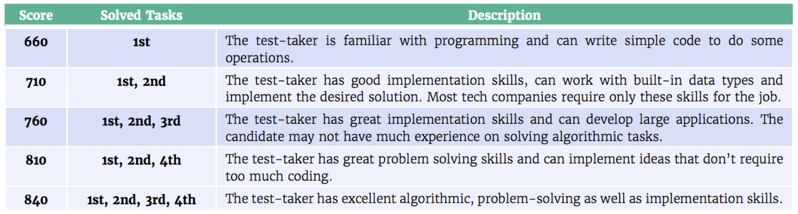

## Online Assessment/Coding Tests

Figure 1 An example of an OA question - this used to be asked by Capital One from at least the 2018-2019 season up until the 2021-22 season, when they switched to the CodeSignal GCA (covered later on here)

This is generally done at the very first stage, before an interview, and
is often automated (so your resume may have not even been read yet!).
There is generally a cut-off score; you should aim to get everything
right, but in some cases, it is possible to progress without getting the
entire test right, especially if the test is harder than usual. Note
that doing well on the OA does not mean that you will progress to the
interview as a result (Databricks and JP Morgan being examples).

Figure 2 Constraints provided for a HackerRank problem. You’re going to
see this in nearly every OA question and is a <u>huge</u> clue for you.

Use the information in a question to your advantage! It will often
implicitly tell you how efficient your algorithm should be to get full
points. Consider the fact that a computer can run 108
iterations per second. You’re usually going to be given an array or
string; call its size _n_. Note that you **cannot** be asked to come
up with a solution better than O(_n_) in this case (even if one
exists); the reason is that it takes linear time to input the test array
itself! With that in mind,

  - If \(_n_ > 104\), aim for a O(_n_) or a
    O(_n_ log _n_) solution.

  - If \(_n_ > 103\), aim for a O(_n_2) solution

  - If \(_n_ > 102\), aim for a O(_n_3) solution

  - If \(_n_ < 20\), a O(2_n_) solution should be fine.

A good idea is to start from an inefficient solution and work your way
upwards, improving the complexity along the way. You could find out (for
HackerRank) that a supposedly inefficient solution actually works well!
Also note that while an inefficient but working solutions will get you
some points, an efficient but broken solution is useless as no marks are
given for “effort”. Plus you can often “game” the system a bit in such
cases to collect a few more points by leveraging the properties of edge
cases, for instance.

A common question is whether you can look up on the internet when
completing these tests. The answer is generally yes, unless you’ve been
told not to. This is for syntaxial searches, not the entire question (so
asking on how to retrieve from a Java TreeMap is fine) – plagiarism
checkers are there which will detect copied solutions to the problem.

The best way to practice for an online assessment is usually LeetCode.
Indeed, some companies (like JP Morgan) often recycle questions from it,
and it’s otherwise a good place to practice and keep the algorithmic
skills fresh. Doing the [daily
challenges](https://leetcode.com/discuss/general-discussion/655704/november-leetcoding-challenge-new-feature-and-rewards)
is a good way.

### Providers

There are some major providers that run these tests, some of which are
given below:

*HackerRank*

These tests are designed by the company using (generally) HackerRank’s
own questions or that of the company. Usually, you are given a number of
questions to solve in a fixed time frame (anywhere from 30 minutes to 2
hours[1]). You’re generally, but not always, given freedom on the
language you choose to code.  
  
Once you code, there are two kinds of test cases that your code will be
run though:

  - Visible test cases: they are the test cases that you can see what
    the input, and the expected output, was.

  - Hidden test cases: they are the test cases that you’re not given
    what the input or the expected output is and are used to prevent
    people from hard coding the results. Since 2020, you can get some
    information on the test cases by using print/debug statements; use
    them to your advantage.

You can also run your own test cases, and in some cases, you’ll be able
to find out what the expected result should be for that custom test
case.

It used to be the case that HackerRank was known for making you have to do the I/O (input/output) yourself, but this is rare now.  

*Codility*

Mostly similar to HackerRank, with a major difference. You are not given
any information on the hidden test cases, which means that you will not
have a definite idea on whether your code was truly correct (and are not
given a score either), even after completing the test (with the rare
exception, like AMEX). Also, unlike HackerRank, once you “submit” a
solution during a test, you cannot make any changes to it.

*CodeSignal*

Normally used by companies for their GCA (General Coding Assessment)
test, which is a standardised coding examination (think of it as the
SAT/ACT of coding). As a result,

  - It is possible to submit a test result to multiple companies. This
    goes both ways – if you do well once, you won’t have to retake the
    test for a good period of time as you can simply share the result
    for other companies. Similarly, if you do poorly and several
    companies request that score (and you do not have a better one to
    share), you can run into trouble.

  - This is usually the most proctored test you will need to take. Most
    companies will request the proctored variant of the GCA, which means
    that you will be forced to share your screen, present a form of
    identification before the test and have them record you (though they
    say that companies will not be provided proctoring data and is only
    used to confirm that you didn't cheat). A minority will be fine with
    the unproctored variant, but it is recommended to opt-in to
    proctoring since an unproctored test result cannot be sent to
    companies that require proctoring.

The nature of the GCA means that there is significantly more uniformity
in the questions you’ll get compared to the other test types. For the
70-minute test, you’ll get 4 questions.

  - Q1 and Q2 are gimmes and should be crushed as soon as possible.

  - Q3 is usually an implementation-heavy LeetCode Medium problem and
    from experience is usually *bashing*-friendly. What this means is
    there isn’t much in the way of algorithmic complexities to bother
    with – the solution is long, but you simply need to do what it asks
    you to do without worrying about time complexity and such.

  - Q4 is a purely algorithmic LeetCode Medium problem – here you will
    need to focus on getting the time complexity optimal. From
    experience Q4 normally involves a clever application of hashmaps and
    it is expected that you know how to work with it properly. While
    greedy problems are technically possible, DP (dynamic programming)
    questions will *not* show up in Q4 (and this test in general).

Now what about scores? The scoring range is 300 to 850, but anyone
making an attempt at any question will get at least 600. Hence the below
score ranges are more common.

Figure 3
<https://support.codesignal.com/hc/en-us/articles/360039879414-What-s-a-Coding-Score-and-how-do-I-interpret-my-GCA-Coding-Score->

A score of at least 835 is good, with 760s being a “C” grade (though
companies like Capital One seem to be OK with scores in the 710 range).
Regardless, if you do not do well, you can retake after 14 days (and
hence the “damage” is limited to the one company whose score you sent).

Figure 4 A CodeSignal test report (which is similar to what companies will
see)

You will also get a “score” out of 1200, 300 for each question.
Disregard it. Also, unlike most other testing platforms, CodeSignal is
*very* unforgiving with incomplete solutions (which are likely in Q4
with suboptimal solutions) – it may seem like you got 70% of the test
cases right (and get a score like 210/300) but get a scaled score that
seemed like you got nothing. Partial marking is almost non-existent and
you need to get the entire question right to get points for it in
practice. Also notice above that you’ll get a triangular graph that show
your implementation, problem solving and speed – do not worry about them
too much. The scaled score out of 850 is the most important.

It may help to try out some CodeSignal GCA practice tests (which you can
take every day or so). The scoring algorithm is the same, and the
questions give a good approximation on what you would get on the actual
test.

In rare cases, you may be given a non-GCA examination (wherein the
questions are written by the company, much like HackerRank, and there is
no scaled score), in which case most of what was written for the HackerRank section would
apply here.

*Hirevue*

While relatively less common as a coding assessment platform, companies
like BlackRock and JP Morgan use them, so it’s still around. The main
difference is that the interface is a bit clunky – while in other
platforms you shouldn’t have to mess with the I/O (input/output), this
isn’t the case for Hirevue. Plus you cannot even enter your own custom
test cases, and there is little information on how they actually grade
your solution.

It should be noted that the above covers only algorithmic-style
questions; in rare cases you may be given a more specialised form of the
test (such as a front-end variant). Those kinds of tests are out of
scope for this guide.

### Non-coding tests

This section covers some common non-coding tests that you may be asked
to take.

*Mathematics (Goldman Sachs only)*

Goldman Sachs is unique in that during the application process (for
Engineering), you are given a choice on whether to take the purely
coding examination (of 120 minutes) or the combined CS + Maths exam (of
180 minutes). As of writing, the latter is required only if you’re
applying for the strats sub-division and is optional otherwise. The CS
portion is just like a standard HackerRank examination (one LeetCode
easy + one LeetCode medium), the below describes the 60-minute
mathematics portion of the test. Note that the 180 minutes in the test
is combined – so you can freely switch between the CS and Maths portion
of the test. All 10 questions in the Maths section are MCQ, and there is
no negative marking (however unlike the CS section, you are not given an
indication on whether the answers are correct, even after the test).

The Mathematics section for GS covers three major domains:

  - Probability, combinatorics and elementary statistics – you may have
    covered a lot of this in high school, and an introductory probability course would be enough
    for this section.
  - Linear algebra - this usually goes a bit beyond what you have covered in high school, but an introductory linear algebra course should suffice. 
  - Calculus – your high school knowledge would be enough. Multivariate
  calculus in any form is not required for the test.

Even though the syllabus may seem easy, it’s curved well in practice.
This means that you will see questions that span a wide range of
difficulty levels, and some of them will be tricky. It is not required
to get a perfect mark on the mathematical section to proceed, though aim
to get as much as you can.

*Correlation One (C1)-based tests*

These are tests you may be asked to take for some data science and
quantitative roles (examples include DRW and GSA Capital) and is
somewhat difficult to do well. Knowledge of some machine learning (the
Intro to ML course should be enough) is expected, plus very good
probability, statistics, and linear algebra (generally to the level of
a university-level module in each of them). It’s usually 30 minutes/8 questions or 60
minutes/15 questions, and the questions are time-consuming and it’s easy
to run out of time, so good time management is very important. As with
some others, you are not given a score upon completion.

*Situational Judgement Tests (SJT)*

These are non-technical tests where you’re given a hypothetical
situation and are asked what you would do in that case. They can come
either as a standalone test or as part of a larger “immersive”
assessment:

Figure 5 An example of a SJT test as part of a larger immersive
assessment.

See
<https://www.imperial.ac.uk/careers/applications-and-interviews/psychometric-tests/>
for more information.

*Game-based assessments*

They are tests (such as Pymetrics and Arctic Shores) which make you play
some “games” that claim to get to measure various cognitive and
personality skills of a person. Things you may be asked to do is to
determine whether you consider a particular transaction fair, determine
the emotions of people, and recall numbers as part of a memory test.
There is no coding or mathematics in these tests.

There isn’t much one can practice for them, and resources are relatively
sparse.

Note that these tests (and SJTs) can discriminate negatively against
some candidates. If you’re running into a situation where you
consistently do well in coding/mathematical examinations but very poorly
in Pymetrics or SJT-based tests and are not otherwise diagnosed, please
consider getting tested for autism or a SpLD (specific learning disability).
If you are diagnosed, please disclose this - some companies like Flow Traders appear to be inflexible, but you may not have a choice as you are likely to be trashed either way. 
1.  In rare cases, they may be longer, or “take-home” styled in some
    cases (for instance Tibra and Optiver) where you’re given up to 2 –
    3 days from the time you start. The questions are no different
    usually.