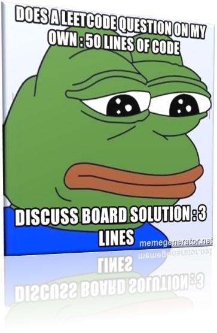
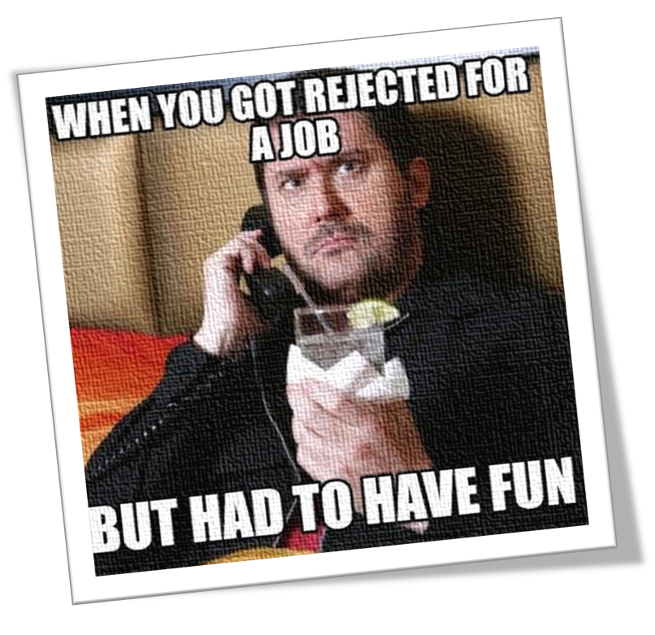

# Online assessments and interviews
The guide to online assessments and interviews. This is not a RTM release and is still well in the beta range. Feedback and contributions are welcome and appreciated. 

This repository consists of two sections:
<!-- https://gist.github.com/DavidWells/7d2e0e1bc78f4ac59a123ddf8b74932d -->

  

* A guide into online assessments (and getting feedback using the GDPR). I would also like to see guides for other sections such as interviews, but do not have sufficient experience to write one myself. Contribution from others would be greatly appreciated. 

> The above image actually has a takeaway: there is no need to feel grumpy over a "long" or "ugly" solution! Online assessments don't care about any of that - only whether your solution is correct (and efficient). 

  

* A section giving (insightful) application experiences into various companies by year (as long as it was not a case of getting rejected after application with nothing else), with as much raw detail provided as possible. 

> Rather than "fun", I would call this time-consuming. But this is done to help others. Also, if my failure is the cause of the success of someone else, that's my consolation prize. 
### Contributing

Please use GitHub issues to contribute to this repository, either by pull requests or by simply creating a new issue. For regular discussion, GitHub Discussion is also available. 

### Licensing

**This repository is _not_ designed to be forked.** Please do not fork this repository unless you intend to contribute; star or watch this repository instead. Reasoning for this is given below. 

 This work, in general, is licensed under a <a rel="license" href="http://creativecommons.org/licenses/by-nc-nd/4.0/">Creative Commons Attribution-NonCommercial-NoDerivatives 4.0 International License</a>.

In particular, modifications of this repository may **not** be shared by default. This may sound restrictive, but the intention is to prevent the interviews portion (which are contributed by users, including myself) from being inappropriately modified, and to encourage contributing to a central repository instead of creating potentially disjoint forks. The exception is if you plan to contribute using GitHub issues; since GitHub can automatically create forks during the process, any (disjoint) forks as part of that would be fine. Please do let me know if exceptions are needed. 

**Credits** for the images in this page: [here](https://memegenerator.net/instance/68818083/sad-pepe-does-a-leetcode-question-on-my-own-50-lines-of-code-discuss-board-solution-3-lines) and [here](https://www.memecreator.org/meme/when-you-got-rejected-for-a-job-but-had-to-have-fun/).